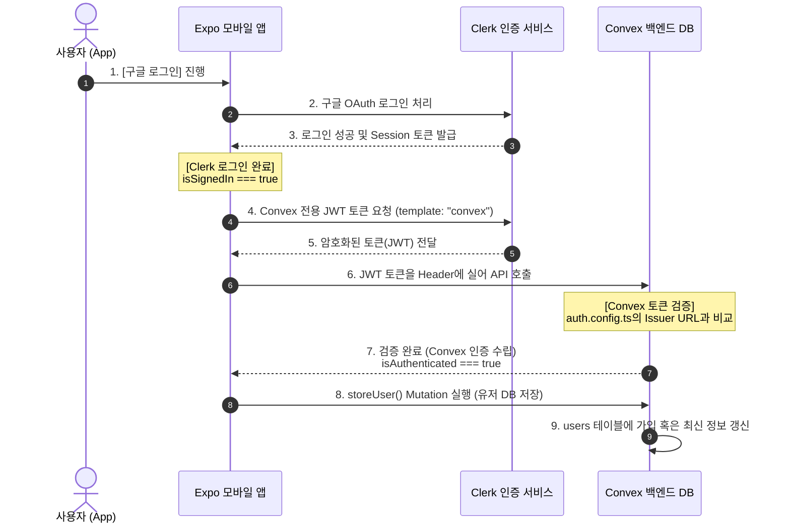

# 🔐 Clerk (인증) & Convex (실시간 DB) 연동 총정리 가이드

이 문서는 **Clerk(소셜 로그인 인증)**과 **Convex(실시간 백엔드 데이터베이스)**를 완벽하게 연결하여, 모바일 Expo 앱에서 로그인한 유저의 세션을 안전하게 검증하고 Convex DB(`users` 테이블)에 실시간으로 연동 및 보관하는 전 과정을 초보자 눈높이로 세밀하게 설명합니다.

---

## 🗺️ 인증 및 DB 저장 시스템 메커니즘 (Concept)

모바일 앱이 어떻게 사용자를 로그인 시키고, 백엔드 DB가 이를 안전하게 믿고 저장하는지에 대한 핸드셰이크(Handshake) 흐름입니다.



---

## 🔑 초보자를 위한 2대 상태 핵심 차이점
초보 개발자들이 개발할 때 가장 실수를 많이 하는 부분입니다. 두 상태의 차이를 꼭 이해해야 에러를 방지할 수 있습니다.

* **`isSignedIn` (Clerk의 상태)**: *"사용자가 구글 로그인을 마쳐서, 구글 세션을 가지고 있는가?"*를 뜻합니다.
* **`isAuthenticated` (Convex의 상태)**: *"로그인 정보를 토대로 Convex 서버가 이 유저를 신뢰하고 통신 연결을 완료했는가?"*를 뜻합니다.
* **⚠️ 주의**: `isSignedIn`이 즉시 `true`가 되더라도, Clerk 토큰이 Convex 서버로 날아가 최종 확인을 거칠 때까지 수 밀리초의 지연 시간이 발생합니다. 이 타이밍에 백엔드 DB 조회를 성급하게 시도하면 **"인증되지 않은 요청입니다"**라는 런타임 오류가 발생합니다.

---

## 🚀 단계별 연동 절차

---

### 1단계: Clerk 웹 대시보드 설정

#### ① API 키 복사 및 `.env.local` 기입
1. [Clerk Dashboard](https://dashboard.clerk.com) 접속 -> 본인 프로젝트 선택 -> 왼쪽 **API Keys** 클릭.
2. `Publishable key`를 복사하여 프로젝트 루트 폴더의 `.env.local` 파일에 등록합니다.
   ```env
   EXPO_PUBLIC_CLERK_PUBLISHABLE_KEY=pk_test_자신의_Clerk_키
   ```

#### ② Convex 전용 JWT 템플릿 생성 (매우 중요 🌟)
구글 로그인을 통해 알게 된 유저의 이름, 프로필 사진 URL, 이메일 등의 정보를 Convex에 전달하기 위한 암호화 가방을 제작합니다.
1. Clerk Dashboard의 왼쪽 메뉴 중 **Configure** > **JWT Templates** 메뉴로 이동합니다.
2. **New Template** 버튼을 클릭하고 **Custom**을 선택합니다.
3. 템플릿 세부 정보를 아래와 같이 완벽히 동일하게 작성합니다:
   * **Name**: `convex` (⚠️ **전부 영어 소문자**여야 합니다. 대문자가 섞이거나 이름이 다르면 연동이 실패합니다.)
   * **Claims (JSON Editor)**: 기존 JSON 내용을 다 지우고 아래의 코드를 복사해서 붙여넣습니다:
     ```json
     {
       "aud": "convex",
       "email": "{{user.primary_email_address}}",
       "name": "{{user.first_name}} {{user.last_name}}",
       "pictureUrl": "{{user.image_url}}",
       "nickname": "{{user.username}}"
     }
     ```
     > **💡 팁**: 중괄호 두 개 `{{...}}`는 Clerk이 로그인한 회원의 정보를 동적으로 갈아끼워 주는 변수 표기법입니다.
4. 하단의 **Save** 버튼을 눌러 생성합니다.
5. 저장 후 템플릿 설정 화면 아래쪽에 나타나는 **Issuer URL** 주소값을 복사해 별도로 기록해 둡니다. *(예: `https://deciding-blowfish-74.clerk.accounts.dev`)*

---

### 2단계: Convex 백엔드 DB 및 인증 설정

#### ① Convex 백엔드 인증 활성화 (`auth.config.ts`)
Convex 백엔드가 Clerk에서 보내온 입장권(JWT)을 확인하고 신뢰할 수 있게 설정합니다.
1. [convex/auth.config.ts](file:///Users/guniluk/Desktop/CLI/webMobile-instagram/convex/auth.config.ts) 파일을 열거나 생성하고 다음과 같이 작성합니다:
   ```typescript
   export default {
     providers: [
       {
         // 1단계 ②에서 복사한 Clerk Issuer URL을 기입합니다.
         domain: "https://deciding-blowfish-74.clerk.accounts.dev", // 👈 본인의 Issuer URL로 대체
         applicationID: "convex",
       },
     ],
   };
   ```
   > ⚠️ **주의**: `domain` 주소 적을 때 끝에 슬래시(`/`)가 포함되면 연동이 실패하므로 절대 넣지 마세요.

#### ② 사용자 테이블 스키마 정의 (`schema.ts`)
데이터를 담을 테이블 형태를 만들어 줍니다.
* **파일 경로**: [convex/schema.ts](file:///Users/guniluk/Desktop/CLI/webMobile-instagram/convex/schema.ts)
```typescript
import { defineSchema, defineTable } from "convex/server";
import { v } from "convex/values";

export default defineSchema({
  users: defineTable({
    clerkId: v.string(),        // Clerk 사용자 고유 고유 ID
    username: v.string(),       // 사용자 아이디 (닉네임)
    fullname: v.string(),       // 사용자 실제 성명
    email: v.string(),          // 이메일 주소
    bio: v.optional(v.string()),// 자기소개 (선택 입력)
    image: v.string(),          // 프로필 이미지 CDN URL
    followers: v.number(),      // 팔로워 수
    following: v.number(),      // 팔로잉 수
    posts: v.number(),          // 게시글 개수
  }).index("by_clerk_id", ["clerkId"]), // Clerk ID 조회를 초고속화하기 위한 인덱스 설정
  
  // (이하 생략 - 상세 구조는 schema.ts 참조)
});
```

#### ③ 사용자 연동 Mutation 작성 (`users.ts`)
Clerk의 JWT 정보를 읽어서 DB에 새롭게 회원 등록을 하거나, 정보 업데이트가 필요할 때 덮어씌워 주는 백엔드 로직입니다.
* **파일 경로**: [convex/users.ts](file:///Users/guniluk/Desktop/CLI/webMobile-instagram/convex/users.ts)
```typescript
import { mutation } from "./_generated/server";

export const storeUser = mutation({
  args: {},
  handler: async (ctx) => {
    // 1. Clerk이 보내준 유저 정보(JWT) 획득
    const identity = await ctx.auth.getUserIdentity();
    if (!identity) {
      throw new Error("인증되지 않은 요청입니다.");
    }

    // 2. 이미 DB에 해당 유저가 가입되어 있는지 확인
    const user = await ctx.db
      .query("users")
      .withIndex("by_clerk_id", (q) => q.eq("clerkId", identity.subject))
      .unique();

    const email = identity.email ?? "";
    const username = identity.nickname ?? email.split("@")[0] ?? "user";
    const fullname = identity.name ?? username;
    const image = identity.pictureUrl ?? "";

    // 3. DB에 없는 신규 유저라면 가입 처리(insert)
    if (user === null) {
      return await ctx.db.insert("users", {
        clerkId: identity.subject,
        email,
        username,
        fullname,
        image,
        followers: 0,
        following: 0,
        posts: 0,
      });
    }

    // 4. 이미 존재하는 유저라면 정보 최신화(patch)
    await ctx.db.patch(user._id, {
      email,
      username,
      fullname,
      image,
    });

    return user._id;
  },
});
```

---

### 3단계: 프론트엔드(Expo) 안전한 동기화 연결

#### ① 루트 레이아웃에서 Clerk & Convex 제공자 결합 (`app/_layout.tsx`)
프론트엔드 전역에 상태 관리를 뿌려주는 Provider를 계층별로 결합합니다.
* **파일 경로**: [app/_layout.tsx](file:///Users/guniluk/Desktop/CLI/webMobile-instagram/app/_layout.tsx)
```tsx
import { ClerkProvider, useAuth } from "@clerk/expo";
import { ConvexReactClient } from "convex/react";
import { ConvexProviderWithClerk } from "convex/react-clerk";
import { tokenCache } from "../clerk-expo/tokenCache";

const convex = new ConvexReactClient(process.env.EXPO_PUBLIC_CONVEX_URL!);

export default function RootLayout() {
  return (
    <ClerkProvider publishableKey={publishableKey} tokenCache={tokenCache}>
      {/* useAuth를 주입받아 Convex에 유저 인증 상태를 통째로 이관합니다. */}
      <ConvexProviderWithClerk client={convex} useAuth={useAuth}>
        <MainLayout />
      </ConvexProviderWithClerk>
    </ClerkProvider>
  );
}
```

#### ② 엇갈림 방지(Race Condition)를 고려한 안전한 호출 시점 설계
로그인이 완전히 성공한 시점(`isAuthenticated === true`)에만 백엔드 가입 함수를 호출하도록 안전망을 설계합니다.
* **파일 경로**: [app/_layout.tsx](file:///Users/guniluk/Desktop/CLI/webMobile-instagram/app/_layout.tsx) 내 `MainLayout` 컴포넌트 내부
```tsx
import React from "react";
import { useAuth } from "@clerk/expo";
import { useMutation, useConvexAuth } from "convex/react";
import { api } from "@/convex/_generated/api";
import { useRouter, useSegments } from "expo-router";

function MainLayout() {
  const { isLoaded, isSignedIn } = useAuth();
  const { isAuthenticated } = useConvexAuth(); // Convex 인증 수립 여부 체크!
  const storeUser = useMutation(api.users.storeUser);
  const segments = useSegments();
  const router = useRouter();

  // 1. 라우팅 조건 분기 (Clerk 로그인 여부에 맞춰 화면 리다이렉션)
  React.useEffect(() => {
    if (!isLoaded) return;
    const inAuthGroup = segments[0] === "(auth)";

    if (!isSignedIn && !inAuthGroup) {
      router.replace("/(auth)/sign-in");
    } else if (isSignedIn && inAuthGroup) {
      router.replace("/(tabs)");
    }
  }, [isLoaded, isSignedIn]);

  // 2. 🌟 안전한 DB 연동 시점 (Convex가 토큰 검증을 통과한 즉시 단 한 번 실행)
  React.useEffect(() => {
    if (isAuthenticated) {
      const syncUser = async () => {
        try {
          // Convex DB 유저 생성 및 동기화 API 호출
          const userId = await storeUser();
          console.log("Convex DB Sync Success! User Table ID:", userId);
        } catch (error) {
          console.error("Convex DB Sync Failed:", error);
        }
      };
      void syncUser();
    }
  }, [isAuthenticated, storeUser]);

  // (이하 생략)
}
```

---

## 🚨 트러블슈팅 및 연동 확인 자가 진단 (Self Check)

### 📋 연동 성공 여부 자가 진단표
1. [ ] 구글 로그인을 눌러 정상적으로 프로필 선택 창이 뜨고 인증이 완료되는가?
2. [ ] 로그인 완료 후 앱의 메인 피드(`/(tabs)`) 화면으로 정상적으로 튕겨 들어오는가?
3. [ ] **Convex Dashboard**의 **Data** 탭을 열었을 때 `users` 테이블에 내 구글 프로필 정보가 행(Row)으로 잘 쌓여 있는가?
4. [ ] 로그아웃을 진행했을 때 첫 화면인 `/(auth)/sign-in`으로 올바르게 되돌아가는가?

---

### 🚨 자주 마주치는 3대 에러 해결책

#### 1. `Error: [e: No JWT template exists with name: convex]`
* **원인**: Clerk 웹 대시보드에 설정해 둔 커스텀 JWT Template 이름이 소문자 `convex`가 아닌 다른 이름(예: `Convex`, `convex-template` 등)으로 설정되었기 때문입니다.
* **해결법**: Clerk Dashboard -> JWT Templates로 이동하여 생성한 템플릿의 Name 속성을 모두 소문자인 **`convex`**로 수정하고 저장해 주세요.

#### 2. `Error: 인증되지 않은 요청입니다.` (Unauthorized Request)
* **원인**: 모바일 앱 코드에서 `isAuthenticated` 상태가 아직 `true`로 바뀌지 않아 토큰 검증이 끝나지 않았는데, `storeUser()`나 다른 DB 관련 쿼리/뮤테이션을 먼저 작동시켜 발생합니다.
* **해결법**: `useEffect` 훅 내부에서 `storeUser()`를 부를 때 의존성 배열에 반드시 `isAuthenticated`를 명시하고 `if (isAuthenticated) { ... }` 조건으로 감싸서 호출을 보장해야 합니다. (3단계 ②의 안전장치 코드 참고)

#### 3. Clerk 대시보드에서 `Issuer URL`이나 JWT 설정을 바꿨는데 시뮬레이터 앱에 반영이 안 돼요!
* **원인**: 모바일 Expo Metro 서버에 인증 캐시가 매우 완강히 남아서 생기는 고질적인 현상입니다.
* **해결법**: 현재 기동 중인 Expo 터미널 창을 끄고, 아래 캐시 클리어 명령어를 통해 실행해 주시면 완벽히 해결됩니다:
  ```bash
  npx expo start -c
  ```
