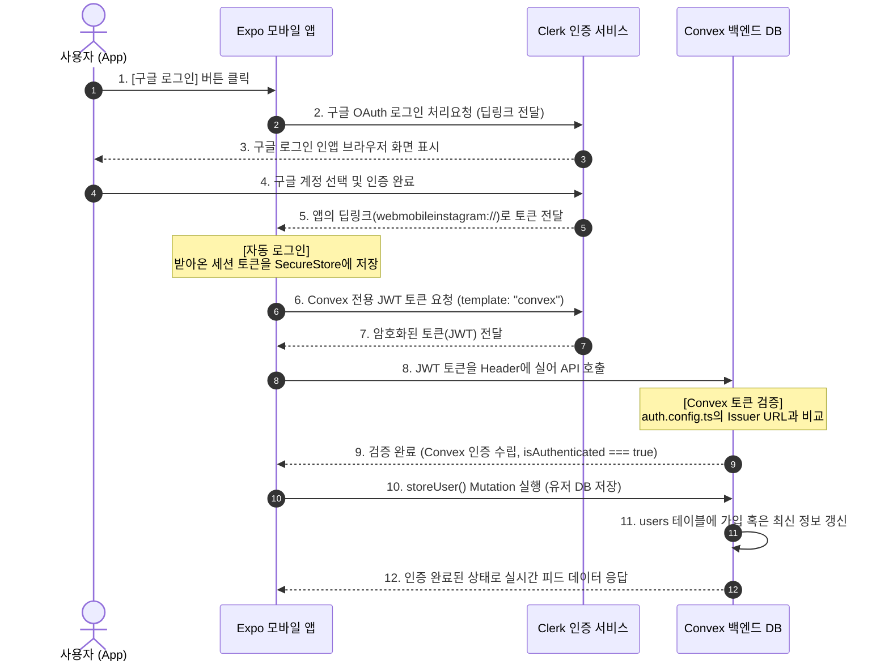
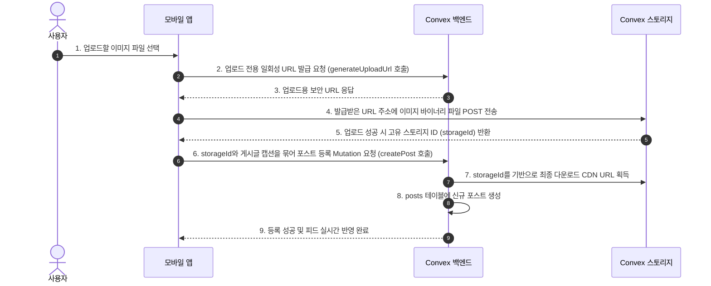

# 📸 BYH Instagram (실시간 반응형 인스타그램 클론 앱) 초보자 종합 가이드

이 프로젝트는 **Expo SDK 54 (React Native)**를 기반으로 구축된 모바일 인스타그램 클론 애플리케이션입니다. **Clerk**을 통한 강력한 소셜 인증과 **Convex 서버리스 실시간 데이터베이스 및 스토리지**를 유기적으로 연동하여, 로컬 목데이터(Mock Data) 없이 **100% 실제 데이터로 구동되는 완벽한 모바일 풀스택 서비스**를 구현했습니다.

<div id="toc"></div>

---

## 📌 목차

1. [🛠️ 기술 스택 (Tech Stack)](#tech-stack)
2. [📂 프로젝트 폴더 구조 및 파일 역할](#folder-structure)
3. [🗺️ 한눈에 보는 전체 작동 아키텍처](#architecture)
4. [🔑 필수 개념 및 상태 이해하기](#concepts)
5. [🚀 처음부터 끝까지 따라하는 단계별 연동 가이드](#guide)
6. [📱 페이지 구성 및 동작 (Screens & Functions)](#screens-functions)
7. [🌐 실제 배포하기 (Production Deployment)](#deployment)
8. [🚨 트러블슈팅 및 자주 묻는 질문 (FAQ)](#faq)
9. [🛠️ 핵심 CLI 명령어 요약](#cli-commands)

---

<div id="tech-stack"></div>

## 🛠️ 기술 스택 (Tech Stack)

### **Frontend (Mobile)**
* **Core Framework**: [Expo SDK 54](https://docs.expo.dev/versions/v54.0.0/) (React Native)
* **Routing**: Expo Router v6 (파일 시스템 기반 파일 라우팅 구조)
* **Authentication**: [Clerk Expo SDK](https://clerk.com/) (`@clerk/expo` 및 `expo-secure-store` 자동 로그인 세션 캐싱)
* **Database Binding**: Convex React Client (실시간 WebSocket 기반 반응형 훅 `useQuery`, `useMutation`)

### **Backend & Database**
* **Realtime Backend**: [Convex](https://www.convex.dev/) (WebSocket 기반 실시간 데이터 바인딩, 서버리스 Mutation/Query/Action)
* **File Storage**: Convex File Storage (업로드용 퍼블릭 CDN URL 자동 생성 및 스토리지 관리)
* **Webhook Verification**: [Svix](https://www.svix.com/) (Clerk 회원 이벤트를 실시간 백그라운드로 안전하게 검증 및 수신)

[⬆️ 목차로 돌아가기](#toc)

---

<div id="folder-structure"></div>

## 📂 프로젝트 폴더 구조 및 파일 역할

```text
webMobile-instagram/
 ├── app/                      # Expo Router 기반 화면 라우팅 디렉토리
 │    ├── (auth)/              # 비로그인 사용자 전용 화면 (인증 게이트)
 │    │    ├── _layout.tsx     # 인증 페이지 레이아웃
 │    │    └── sign-in.tsx     # Clerk 구글 소셜 로그인 화면
 │    ├── (tabs)/              # 로그인 성공 후 하단 탭 내비게이션 화면군
 │    │    ├── _layout.tsx     # 하단 탭바 레이아웃 및 내비게이션 바
 │    │    ├── index.tsx       # 홈 피드 화면 (상단 유저 목록 고정, 게시글 실시간 뷰, 로그아웃)
 │    │    ├── bookmarks.tsx   # 북마크(저장됨) 목록 화면 (소형 가로 카드식 레이아웃)
 │    │    ├── create.tsx      # 새 게시글 작성 및 Convex 이미지 실제 업로드 화면
 │    │    ├── notification.tsx# 실시간 알림 센터 (좋아요, 댓글, 팔로우 알림 확인 및 개별 지우기)
 │    │    └── profile.tsx     # 프로필 화면 (내 게시글 소형 가로 카드 뷰, 타인 프로필 조회 및 팔로우 토글, Bio 편집)
 │    └── _layout.tsx          # 최상위 루트 레이아웃 (Clerk + Convex Providers 연동 및 초기 유저 동기화)
 ├── assets/                   # 이미지, 아이콘 등 정적 자원
 ├── clerk-expo/               # Clerk 자동 로그인을 위한 유틸 폴더
 │    └── tokenCache.ts        # SecureStore 기반 Clerk Token 암호화 저장 세션 캐시 설정
 ├── constants/                # 테마 색상 등 디자인 상수 정의
 ├── convex/                   # Convex 실시간 백엔드 소스코드 폴더 (핵심 비즈니스 로직)
 │    ├── _generated/          # 자동 생성되는 API 타입 및 바인딩 폴더
 │    ├── auth.config.ts       # Clerk JWT 로그인 토큰 복호화 및 검증용 설정
 │    ├── http.ts              # Clerk Webhook 수신용 엔드포인트 및 Svix 검증 API
 │    ├── schema.ts            # DB 테이블 스키마 정의
 │    ├── posts.ts             # 게시물 조회, 생성, 삭제 및 업로드 URL 발급 로직
 │    ├── likes.ts             # 좋아요 토글 및 관련 알림 실시간 자동 생성
 │    ├── comments.ts          # 특정 포스트 댓글 목록 조회 및 추가
 │    ├── bookmarks.ts         # 북마크 저장/해제 및 북마크 목록 조회
 │    ├── follows.ts           # 사용자 간 팔로우/언팔로우 토글 및 상태 조회
 │    ├── notifications.ts     # 사용자별 알림 목록 조회 및 개별 삭제
 │    └── users.ts             # Clerk 세션 기준 유저 생성/동기화 및 프로필 변경 쿼리
 ├── store/                    # 기존 Zustand 스토어 흔적 (Convex 실시간 훅 대체로 정리 완료 🧹)
 └── styles/                   # 화면별 디자인/스타일 객체 폴더
```

[⬆️ 목차로 돌아가기](#toc)

---

<div id="architecture"></div>

## 🗺️ 한눈에 보는 전체 작동 아키텍처

### 1. 로그인 인증 및 DB 저장 시스템 메커니즘
모바일 앱이 어떻게 사용자를 로그인 시키고, 백엔드 DB가 이를 안전하게 신뢰하여 동기화 및 저장하는지에 대한 흐름입니다.



### 2. Convex Storage 이미지 업로드 메커니즘
이미지를 스토리지에 올리고, DB에 등록하여 실시간으로 피드에 반영하는 순서도입니다.



[⬆️ 목차로 돌아가기](#toc)

---

<div id="concepts"></div>

## 🔑 필수 개념 및 상태 이해하기

초보 개발자분들이 개발할 때 가장 흔히 겪는 문제를 해결하기 위한 기본 핵심 지식입니다.

### 1. `isSignedIn` vs `isAuthenticated` 상태 구분
* **`isSignedIn` (Clerk의 상태)**: 사용자가 구글 로그인을 마쳐서 구글 세션을 가지고 있는지를 뜻합니다.
* **`isAuthenticated` (Convex의 상태)**: 로그인 세션을 토대로 Convex 서버가 이 유저를 신뢰하고 통신 연결을 마친 상태입니다.
* ⚠️ **주의**: `isSignedIn`이 즉시 `true`가 되더라도, Clerk 토큰이 Convex 서버로 날아가 최종 검증을 거칠 때까지 수 밀리초의 지연 시간이 있습니다. 이 타이밍에 백엔드 DB 쿼리를 즉시 호출하면 **"인증되지 않은 요청입니다"**라는 런타임 오류가 발생하므로 반드시 `isAuthenticated === true` 시점에 DB 호출을 시작해야 합니다.

### 2. Convex의 핵심 함수 종류
* **Query (쿼리)**: DB 데이터를 가져옵니다. 읽기 전용이며, DB의 값이 바뀌면 프론트엔드가 자동으로 실시간 갱신(Reactive)됩니다.
* **Mutation (뮤테이션)**: DB 데이터를 생성, 수정, 삭제(CRUD)합니다. 트랜잭션이 보장됩니다.
* **Action (액션)**: 외부 API 호출이나 비동기 결제 처리, 난수 생성 등 부작용(Side Effect)이 있는 로직을 안전하게 실행합니다.
* **HTTP Action**: 외부 서비스(예: Clerk Webhook)로부터 수신을 대기하는 특수 용도의 웹 웹훅 엔드포인트입니다.

[⬆️ 목차로 돌아가기](#toc)

---

<div id="guide"></div>

## 🚀 처음부터 끝까지 따라하는 단계별 연동 가이드

---

### 1단계: Clerk 가입 및 애플리케이션 생성
1. **[Clerk 공식 홈페이지(clerk.com)](https://clerk.com)**에 접속해 회원가입을 완료합니다.
2. 대시보드로 이동한 뒤 **Create Application** 버튼을 클릭합니다.
3. **Application name**을 입력합니다 (예: `webMobile-instagram`).
4. **How will users sign in?** 목록에서 **Google**만 선택하고 기본 체크되어 있는 *Email address*, *Password* 등은 해제합니다 (소셜 로그인 전용 앱 설정).
5. **Create Application** 버튼을 클릭하여 개설을 마칩니다.
6. 첫 화면에 생성된 `EXPO_PUBLIC_CLERK_PUBLISHABLE_KEY` (예: `pk_test_...`)를 복사해 둡니다.

---

### 2단계: Expo 모바일 앱 라이브러리 설치
터미널을 열고 프로젝트 루트 디렉토리에서 다음 명령어를 실행하여 Clerk 세션 보관 및 소셜 로그인 실행을 위한 라이브러리들을 설치합니다:

```bash
npx expo install @clerk/expo expo-secure-store expo-auth-session expo-web-browser
```

* `@clerk/expo`: 로그인 상태 감지 및 소셜 로그인을 제공하는 SDK.
* `expo-secure-store`: 자동 로그인 유지를 위해 세션 토큰을 기기에 암호화하여 저장합니다.
* `expo-auth-session` / `expo-web-browser`: 외부 구글 로그인창을 인앱 브라우저로 띄우고 다시 원래 모바일 앱으로 튕겨돌려 보내는 브릿지 라이브러리입니다.

---

### 3단계: 환경 변수 등록 및 앱 딥링크 등록

#### ① `.env.local` 파일 생성
프로젝트 루트 디렉토리에 [.env.local](file:///Users/guniluk/Desktop/CODING/webMobile-instagram/.env.local) 파일을 만들고, 1단계에서 얻은 API 키를 입력합니다.
```env
# 프로젝트 루트 폴더/.env.local
EXPO_PUBLIC_CLERK_PUBLISHABLE_KEY=pk_test_자신의_Clerk_키_입력
```
> ⚠️ **중요**: Expo에서는 환경변수 접두사로 반드시 `EXPO_PUBLIC_`을 기입해야 프론트엔드 네이티브 코드에서 올바르게 호출할 수 있습니다.

#### ② `app.json`에 딥링크 Scheme 등록
구글 로그인 완료 후 사용자가 기기 브라우저에서 원래 우리 모바일 앱으로 복귀할 수 있게 하는 앱 딥링크 식별자를 선언합니다. [app.json](file:///Users/guniluk/Desktop/CODING/webMobile-instagram/app.json)을 열고 `scheme` 속성을 지정합니다:
```json
{
  "expo": {
    "name": "webMobile-instagram",
    "slug": "webMobile-instagram",
    "scheme": "webmobileinstagram",  // 👈 영문 소문자로 공백 없이 등록합니다.
    ...
  }
}
```

---

### 4단계: Clerk 세션 토큰 캐시 설정
앱을 완전히 껐다 켜도 구글 로그인 세션 상태가 계속 기기에 남아있도록 설정하는 파일입니다. 

* **파일 경로**: [clerk-expo/tokenCache.ts](file:///Users/guniluk/Desktop/CODING/webMobile-instagram/clerk-expo/tokenCache.ts)
```typescript
import * as SecureStore from 'expo-secure-store';
import { Platform } from 'react-native';

const createTokenCache = () => {
  return {
    async getToken(key: string) {
      try {
        if (Platform.OS === 'web') {
          return localStorage.getItem(key);
        }
        return await SecureStore.getItemAsync(key);
      } catch (error) {
        console.error('Clerk tokenCache.getToken error:', error);
        return null;
      }
    },
    async saveToken(key: string, value: string) {
      try {
        if (Platform.OS === 'web') {
          localStorage.setItem(key, value);
          return;
        }
        await SecureStore.setItemAsync(key, value);
      } catch (error) {
        console.error('Clerk tokenCache.saveToken error:', error);
      }
    },
    async clearToken(key: string) {
      try {
        if (Platform.OS === 'web') {
          localStorage.removeItem(key);
          return;
        }
        await SecureStore.deleteItemAsync(key);
      } catch (error) {
        console.error('Clerk tokenCache.clearToken error:', error);
      }
    }
  };
};

export const tokenCache = createTokenCache();
```

---

### 5단계: Clerk 리디렉션 주소(Redirect URL) 설정
구글 인증에 성공한 뒤, Clerk이 신뢰하고 사용자를 되돌려보낼 화이트리스트 주소를 Clerk 웹 대시보드에 직접 등록해야 합니다. **이 설정을 빼먹으면 구글 로그인 완료 후 흰 화면에서 무한 대기 상태가 됩니다.**

1. **Clerk 대시보드**에 들어가 해당 프로젝트를 클릭합니다.
2. 왼쪽 사이드바에서 **Configure** > **Paths** 메뉴로 이동합니다.
3. **Redirect URLs** 란의 **Add Redirect URL** 버튼을 클릭합니다.
4. 아래 주소를 입력한 뒤 추가합니다:
   * **실기기 및 시뮬레이터 테스트용**: `webmobileinstagram://(tabs)` (본인이 3단계 ②에서 정의한 `scheme://(tabs)` 조합)
   * **Expo Go 디버깅용**: 만약 Metro 무선망 테스트 중 IP 기반 주소(`exp://192.168.x.x:8081`)로 리다이렉트 실패 에러가 뜨면, 에러 화면에 찍힌 그 주소도 같이 이곳에 등록합니다.

---

### 6단계: Clerk Convex 전용 JWT 템플릿 생성
사용자가 구글 로그인을 거쳐 획득한 이메일, 프로필 사진 URL, 닉네임 등의 정보를 암호화 가방(JWT)에 담아 Convex 백엔드에 안전하게 안전하게 넘겨주기 위한 템플릿 설정입니다.

1. **Clerk 대시보드** 왼쪽 사이드바에서 **Configure** > **JWT Templates** 메뉴를 클릭합니다.
2. **New Template** 버튼을 클릭하고 **Custom**을 선택합니다.
3. 템플릿 설정값들을 다음 수칙에 맞춰 완벽히 똑같이 정의합니다:
   * **Name**: `convex` (⚠️ **반드시 대문자가 없는 전부 소문자**여야 합니다. 다르면 백엔드 연동 시 오류가 발생합니다.)
   * **Claims (JSON Editor)**: 기존에 적혀있는 내용을 전부 싹 지우고 아래의 코드를 붙여넣습니다:
     ```json
     {
       "aud": "convex",
       "email": "{{user.primary_email_address}}",
       "name": "{{user.first_name}} {{user.last_name}}",
       "pictureUrl": "{{user.image_url}}",
       "nickname": "{{user.username}}"
     }
     ```
4. 하단의 **Save** 버튼을 눌러 생성을 마칩니다.
5. 저장 후 템플릿 설정 페이지 하단에 생겨나는 **Issuer URL** 주소값(예: `https://your-domain.clerk.accounts.dev`)을 복사하여 따로 적어둡니다.

---

### 7단계: Convex 백엔드 초기화 및 연결
Convex 백엔드를 설치하고 내 로컬 프로젝트 폴더를 Convex 클라우드 백엔드 데이터베이스 서버와 연결합니다.

1. 터미널을 열고 프로젝트 루트 폴더에서 패키지를 설치합니다:
   ```bash
   npm install convex
   ```
2. Convex 로컬 감지 모드 및 백엔드 생성 명령어를 실행합니다:
   ```bash
   npx convex dev
   ```
   * **최초 실행 시**: 브라우저 창이 열리며 Convex 로그인(GitHub 가입 등)을 하라고 뜹니다.
   * 로그인이 완료되면 자동으로 현재 프로젝트와 매핑되는 Convex 클라우드 인스턴스가 뚫리며, 접속 주소가 [.env.local](file:///Users/guniluk/Desktop/CODING/webMobile-instagram/.env.local) 파일의 `EXPO_PUBLIC_CONVEX_URL` 환경 변수에 자동으로 안전하게 저장됩니다.
   * **💡 안내**: `npx convex dev` 명령어는 터미널에 개발 중인 내내 계속 켜두는 것이 좋습니다. 백엔드 코드 수정 시 즉각 컴파일 및 갱신해 줍니다.

---

### 8단계: 데이터베이스 스키마 정의
Convex 클라우드 DB가 가질 테이블의 종류와 컬럼들의 타입을 명시합니다. 스키마에 정의되지 않은 값은 DB에 보관되지 않습니다.

* **파일 경로**: [convex/schema.ts](file:///Users/guniluk/Desktop/CODING/webMobile-instagram/convex/schema.ts)
```typescript
import { defineSchema, defineTable } from "convex/server";
import { v } from "convex/values";

export default defineSchema({
  // 1. 사용자 테이블
  users: defineTable({
    clerkId: v.string(),
    username: v.string(),
    fullname: v.string(),
    email: v.string(),
    bio: v.optional(v.string()),
    image: v.string(),
    followers: v.number(),
    following: v.number(),
    posts: v.number(),
  }).index("by_clerk_id", ["clerkId"]),

  // 2. 게시글 테이블
  posts: defineTable({
    userId: v.id("users"),
    imageUrl: v.string(),
    storageId: v.id("_storage"),
    caption: v.optional(v.string()),
    likes: v.number(),
    comments: v.number(),
  }).index("by_user", ["userId"]),

  // 3. 좋아요 테이블
  likes: defineTable({
    userId: v.id("users"),
    postId: v.id("posts"),
  })
    .index("by_post", ["postId"])
    .index("by_user_and_post", ["userId", "postId"]),

  // 4. 댓글 테이블
  comments: defineTable({
    postId: v.id("posts"),
    userId: v.id("users"),
    content: v.string(),
    createdAt: v.number(),
  }).index("by_post", ["postId"]),

  // 5. 팔로우 테이블
  follows: defineTable({
    followerId: v.id("users"),
    followingId: v.id("users"),
  })
    .index("by_follower", ["followerId"])
    .index("by_following", ["followingId"])
    .index("by_follower_and_following", ["followerId", "followingId"]),

  // 6. 북마크 테이블
  bookmarks: defineTable({
    userId: v.id("users"),
    postId: v.id("posts"),
  })
    .index("by_user", ["userId"])
    .index("by_user_and_post", ["userId", "postId"]),

  // 7. 실시간 알림 테이블
  notifications: defineTable({
    receiverId: v.id("users"),
    senderId: v.id("users"),
    type: v.string(),
    postId: v.optional(v.id("posts")),
    action: v.string(),
    timeAgo: v.string(),
  }).index("by_receiver", ["receiverId"]),
});
```

---

### 9단계: Convex 백엔드 인증 활성화
Convex 백엔드가 Clerk에서 날아온 암호화 입장권(JWT)을 해독할 수 있게 6단계에서 복사한 Clerk Issuer URL을 바인딩해 줍니다.

* **파일 경로**: [convex/auth.config.ts](file:///Users/guniluk/Desktop/CODING/webMobile-instagram/convex/auth.config.ts)
```typescript
export default {
  providers: [
    {
      domain: "https://your-domain.clerk.accounts.dev", // 👈 본인 Issuer URL로 교체
      applicationID: "convex",
    },
  ],
};
```
> ⚠️ **주의**: Issuer URL 적을 때 끝에 슬래시(`/`) 기호가 있으면 인증 통과가 안 되니 절대 넣지 마세요.

---

### 10단계: Convex 가입자 연동 Mutation 작성
전달받은 Clerk의 회원 프로필 세션 가방 정보를 해독하여 Convex DB의 `users` 테이블에 새 회원을 생성하거나 프로필 사진 등이 바뀌면 갱신해주는 백엔드 DB 저장 전용 함수(Mutation)입니다.

* **파일 경로**: [convex/users.ts](file:///Users/guniluk/Desktop/CODING/webMobile-instagram/convex/users.ts)
```typescript
import { mutation } from "./_generated/server";

export const storeUser = mutation({
  args: {},
  handler: async (ctx) => {
    const identity = await ctx.auth.getUserIdentity();
    if (!identity) {
      throw new Error("인증되지 않은 요청입니다.");
    }

    const user = await ctx.db
      .query("users")
      .withIndex("by_clerk_id", (q) => q.eq("clerkId", identity.subject))
      .unique();

    const email = identity.email ?? "";
    const username = identity.nickname ?? email.split("@")[0] ?? "user";
    const fullname = identity.name ?? username;
    const image = identity.pictureUrl ?? "";

    if (user === null) {
      return await ctx.db.insert("users", {
        clerkId: identity.subject,
        email,
        username,
        fullname,
        image,
        followers: 0,
        following: 0,
        posts: 0,
      });
    }

    await ctx.db.patch(user._id, {
      email,
      username,
      fullname,
      image,
    });

    return user._id;
  },
});
```

---

### 11단계: 루트 레이아웃(Provider 및 엇갈림 방지) 구성
Clerk 로그인 세션 상태와 Convex의 실시간 DB 커넥터를 유기적으로 감싸주는 Provider 설정 및 로그인이 완벽히 끝난 후에만 `storeUser`를 안전하게 1회 호출해 유저를 동기화하는 로직입니다.

* **파일 경로**: [app/_layout.tsx](file:///Users/guniluk/Desktop/CODING/webMobile-instagram/app/_layout.tsx)
```tsx
import React, { useEffect } from 'react';
import { ClerkProvider, useAuth } from "@clerk/expo";
import { ConvexReactClient, useMutation, useConvexAuth } from "convex/react";
import { ConvexProviderWithClerk } from "convex/react-clerk";
import { Slot, useRouter, useSegments } from 'expo-router';
import { tokenCache } from '../clerk-expo/tokenCache';
import { api } from "../convex/_generated/api";

const publishableKey = process.env.EXPO_PUBLIC_CLERK_PUBLISHABLE_KEY!;
const convexUrl = process.env.EXPO_PUBLIC_CONVEX_URL!;

const convex = new ConvexReactClient(convexUrl);

export default function RootLayout() {
  return (
    <ClerkProvider publishableKey={publishableKey} tokenCache={tokenCache}>
      <ConvexProviderWithClerk client={convex} useAuth={useAuth}>
        <MainLayout />
      </ConvexProviderWithClerk>
    </ClerkProvider>
  );
}

function MainLayout() {
  const { isLoaded, isSignedIn } = useAuth();
  const { isAuthenticated } = useConvexAuth();
  const storeUser = useMutation(api.users.storeUser);
  const segments = useSegments();
  const router = useRouter();

  useEffect(() => {
    if (!isLoaded) return;
    const inAuthGroup = segments[0] === '(auth)';

    if (!isSignedIn && !inAuthGroup) {
      router.replace('/(auth)/sign-in');
    } else if (isSignedIn && inAuthGroup) {
      router.replace('/(tabs)');
    }
  }, [isLoaded, isSignedIn]);

  useEffect(() => {
    if (isAuthenticated) {
      const syncUser = async () => {
        try {
          const userId = await storeUser();
          console.log("Convex DB User Sync Success! ID:", userId);
        } catch (error) {
          console.error("Convex DB Sync Failed:", error);
        }
      };
      syncUser();
    }
  }, [isAuthenticated, storeUser]);

  return <Slot />;
}
```

---

### 12단계: 구글 소셜 로그인 화면 구현
`useSSO` 훅을 사용해 모바일 웹 브라우저를 띄우고 구글 인증 절차를 실행합니다.

* **파일 경로**: [app/(auth)/sign-in.tsx](file:///Users/guniluk/Desktop/CODING/webMobile-instagram/app/(auth)/sign-in.tsx)
```tsx
import React, { useState } from 'react';
import { StyleSheet, Text, TouchableOpacity, View } from 'react-native';
import { useSSO } from "@clerk/expo";
import * as AuthSession from "expo-auth-session";
import * as WebBrowser from "expo-web-browser";
import { Ionicons } from '@expo/vector-icons';
import { COLORS } from '@/constants/theme';

WebBrowser.maybeCompleteAuthSession();

export default function SignInScreen() {
  const { startSSOFlow } = useSSO();
  const [isLoading, setIsLoading] = useState(false);

  const onGoogleSignIn = async () => {
    try {
      setIsLoading(true);
      
      const redirectUrl = AuthSession.makeRedirectUri({
        scheme: "webmobileinstagram",
        path: "(tabs)",
      });
      
      const { createdSessionId, setActive } = await startSSOFlow({
        strategy: "oauth_google",
        redirectUrl,
      });

      if (createdSessionId && setActive) {
        await setActive({ session: createdSessionId });
      }
    } catch (err) {
      console.error("Google Sign-In Error:", err);
    } finally {
      setIsLoading(false);
    }
  };

  return (
    <View style={styles.container}>
      <Text style={styles.title}>Instagram</Text>
      <TouchableOpacity 
        style={styles.button} 
        onPress={onGoogleSignIn} 
        disabled={isLoading}
      >
        <Ionicons name="logo-google" size={20} color={COLORS.white} />
        <Text style={styles.buttonText}>
          {isLoading ? 'Connecting...' : 'Continue with Google'}
        </Text>
      </TouchableOpacity>
    </View>
  );
}

const styles = StyleSheet.create({
  container: { flex: 1, justifyContent: 'center', alignItems: 'center', backgroundColor: COLORS.background },
  title: { fontSize: 36, fontWeight: 'bold', color: COLORS.white, marginBottom: 40, fontFamily: 'System' },
  button: { flexDirection: 'row', alignItems: 'center', backgroundColor: COLORS.primary, paddingHorizontal: 24, paddingVertical: 14, borderRadius: 8, gap: 10, width: '80%', justifyContent: 'center' },
  buttonText: { color: COLORS.white, fontSize: 16, fontWeight: '600' }
});
```

---

### 13단계: Clerk Webhook 실시간 동기화 수신 서버 구축
모바일 앱이 꺼진 동안이나 외부 브라우저를 통해 유저 가입 및 정보 편집이 일어났을 때, 백그라운드에서 실시간으로 DB 정보를 최신 상태로 유지하는 웹훅 구현입니다.

#### ① svix 모듈 설치
```bash
npm install svix @clerk/backend
```

#### ② Convex httpAction 추가
* **파일 경로**: [convex/http.ts](file:///Users/guniluk/Desktop/CODING/webMobile-instagram/convex/http.ts)
```typescript
import { httpRouter } from "convex/server";
import { Webhook } from "svix";
import { api } from "./_generated/api";
import { httpAction } from "./_generated/server";

export const http = httpRouter();

http.route({
  path: "/clerk-webhook",
  method: "POST",
  handler: httpAction(async (ctx, request) => {
    const webhookSecret = process.env.CLERK_WEBHOOK_SECRET;
    if (!webhookSecret) {
      return new Response("CLERK_WEBHOOK_SECRET not set", { status: 500 });
    }

    const svix_id = request.headers.get("svix-id");
    const svix_timestamp = request.headers.get("svix-timestamp");
    const svix_signature = request.headers.get("svix-signature");

    if (!svix_id || !svix_timestamp || !svix_signature) {
      return new Response("Missing svix headers", { status: 400 });
    }

    const body = await request.text();
    const webhook = new Webhook(webhookSecret);
    let evt: any;

    try {
      evt = webhook.verify(body, {
        "svix-id": svix_id,
        "svix-timestamp": svix_timestamp,
        "svix-signature": svix_signature,
      }) as any;
    } catch (err) {
      console.error("Error verifying webhook:", err);
      return new Response("Error verifying webhook", { status: 400 });
    }

    const eventType = evt.type;
    
    if (eventType === "user.created" || eventType === "user.updated") {
      const { id, email_addresses, first_name, last_name, image_url, username } = evt.data;
      
      const email = email_addresses?.[0]?.email_address ?? "";
      const name = `${first_name || ""} ${last_name || ""}`.trim() || username || email.split("@")[0] || "User";
      const userUsername = username || email.split("@")[0] || "user";

      try {
        await ctx.runMutation(api.users.createOrUpdateUserFromWebhook, {
          clerkId: id,
          email,
          username: userUsername,
          fullname: name,
          image: image_url ?? "",
        });
      } catch (error) {
        console.error("Error syncing user to database:", error);
        return new Response("Error syncing user to database", { status: 500 });
      }
    }
    
    return new Response("Webhook processed successfully", { status: 200 });
  }),
});

export default http;
```

#### ③ Clerk Webhook Endpoint 등록 및 연동
1. **Convex 대시보드 (dashboard.convex.dev)** 접속 -> 본인 프로젝트 선택 -> 왼쪽 **Settings** -> **URL & Deployments**로 이동합니다.
2. **HTTP / Site URL** 주소를 복사합니다. *(예: `https://neat-elk-123.convex.site`)*
3. **Clerk 웹 대시보드** 접속 -> 왼쪽 **Configure** > **Webhooks** 클릭 -> **Add Endpoint** 클릭.
4. **Endpoint URL**에 위의 Convex 웹훅 주소(`https://.../clerk-webhook`)를 입력합니다.
5. **Message Filtering**에서 아래 2가지 이벤트를 선택(체크)합니다:
   * `user.created` (신규 가입 시 실행)
   * `user.updated` (프로필 사진, 닉네임 수정 시 실행)
6. **Create**를 클릭하면 웹훅 엔드포인트가 생성됩니다.
7. 생성 완료 화면 우측에 있는 **Signing Secret** 키값(`whsec_...` 로 시작함)을 복사합니다.
8. 다시 **Convex 대시보드**의 **Settings** -> **Environment Variables**로 이동하여 새로운 환경변수를 등록합니다:
   * **Name**: `CLERK_WEBHOOK_SECRET`
   * **Value**: 복사한 `whsec_...` 문자열 키값 입력 후 Save

---

### 14단계: Convex Storage 미디어 업로드 및 연동
사진을 디바이스 앨범에서 고른 뒤, 임시 주소를 따와 직접 스토리지에 이진 파일(Blob)을 저장하고 게시물을 생성하는 핵심 로직입니다.

#### ① 포스트 생성 및 임시 업로드 주소 발급 API 작성
* **파일 경로**: [convex/posts.ts](file:///Users/guniluk/Desktop/CODING/webMobile-instagram/convex/posts.ts)
```typescript
import { mutation } from "./_generated/server";
import { v } from "convex/values";

export const generateUploadUrl = mutation({
  args: {},
  handler: async (ctx) => {
    return await ctx.storage.generateUploadUrl();
  },
});

export const createPost = mutation({
  args: {
    storageId: v.id("_storage"),
    caption: v.optional(v.string()),
  },
  handler: async (ctx, args) => {
    const identity = await ctx.auth.getUserIdentity();
    if (!identity) throw new Error("인증되지 않았습니다.");

    const user = await ctx.db
      .query("users")
      .withIndex("by_clerk_id", (q) => q.eq("clerkId", identity.subject))
      .unique();
    if (!user) throw new Error("사용자 정보를 찾을 수 없습니다.");

    const imageUrl = await ctx.storage.getUrl(args.storageId);
    if (!imageUrl) throw new Error("이미지 URL 변환 실패");

    const postId = await ctx.db.insert("posts", {
      userId: user._id,
      imageUrl: imageUrl,
      storageId: args.storageId,
      caption: args.caption,
      likes: 0,
      comments: 0,
    });

    return postId;
  },
});
```

#### ② 프론트엔드 모바일 사진 실제 업로드 로직
* **파일 경로**: [app/(tabs)/create.tsx](file:///Users/guniluk/Desktop/CODING/webMobile-instagram/app/(tabs)/create.tsx)
```typescript
const generateUploadUrl = useMutation(api.posts.generateUploadUrl);
const createPost = useMutation(api.posts.createPost);

const handleUpload = async (imageUri: string, captionText: string) => {
  try {
    const uploadUrl = await generateUploadUrl();

    const response = await fetch(imageUri);
    const blob = await response.blob();

    const uploadResponse = await fetch(uploadUrl, {
      method: "POST",
      headers: { "Content-Type": blob.type },
      body: blob,
    });

    if (!uploadResponse.ok) throw new Error("스토리지 업로드 실패");

    const { storageId } = await uploadResponse.json();

    await createPost({
      storageId: storageId,
      caption: captionText,
    });
    
    alert("게시물이 성공적으로 업로드되었습니다!");
  } catch (error) {
    console.error(error);
  }
};
```

---

### 15단계: 각 화면별 Pull-to-refresh 및 키보드 회피 UI 조율
사용자가 피드를 아래로 당겼을 때 돌게되는 새로고침 로딩 아이콘(`RefreshControl`) 및 사진 업로드 중 키보드가 입력창을 가리지 않도록 한 세밀한 보정법입니다.

#### ① 스피너 새로고침 (Pull-to-refresh) 구현
[index.tsx](file:///Users/guniluk/Desktop/CODING/webMobile-instagram/app/(tabs)/index.tsx), [bookmarks.tsx](file:///Users/guniluk/Desktop/CODING/webMobile-instagram/app/(tabs)/bookmarks.tsx), [notification.tsx](file:///Users/guniluk/Desktop/CODING/webMobile-instagram/app/(tabs)/notification.tsx), [profile.tsx](file:///Users/guniluk/Desktop/CODING/webMobile-instagram/app/(tabs)/profile.tsx) 내 `FlatList` 및 `ScrollView`에 `RefreshControl`을 얹어줍니다.

```tsx
import { RefreshControl } from 'react-native';

const [refreshing, setRefreshing] = useState(false);

const onRefresh = React.useCallback(() => {
  setRefreshing(true);
  setTimeout(() => {
    setRefreshing(false);
  }, 1000);
}, []);

// FlatList/ScrollView 렌더링 시 추가
refreshControl={
  <RefreshControl
    refreshing={refreshing}
    onRefresh={onRefresh}
    tintColor={COLORS.white}
    colors={[COLORS.primary]}
  />
}
```

#### ② 키보드에 가려지지 않는 업로드 뷰 (`create.tsx`)
* Android와 iOS의 상호 다른 가림 처리 방식을 고려해 `KeyboardAvoidingView`의 `behavior`를 iOS는 `'padding'`, Android는 `undefined`로 설정합니다.
* `ScrollView` 아래에 여백 `paddingBottom: 120`을 확보하고, `Keyboard` 활성화 이벤트를 수신받아 스크롤을 최하단으로 부드럽게 내리도록 보정했습니다.
```tsx
const scrollViewRef = useRef<ScrollView>(null);

const scrollToBottom = () => {
  setTimeout(() => {
    scrollViewRef.current?.scrollToEnd({ animated: true });
  }, 150);
};

useEffect(() => {
  const showEvent = Platform.OS === 'ios' ? 'keyboardWillShow' : 'keyboardDidShow';
  const showSubscription = Keyboard.addListener(showEvent, scrollToBottom);
  return () => showSubscription.remove();
}, []);
```

[⬆️ 목차로 돌아가기](#toc)

---

<div id="screens-functions"></div>

## 📱 페이지 구성 및 동작 (Screens & Functions)

### 1. 홈 피드 화면 ([index.tsx](file:///Users/guniluk/Desktop/CODING/webMobile-instagram/app/(tabs)/index.tsx))
* **UI 구성**:
  * **상단 스토리 바**: 가로 스크롤이 가능한 유저 아바타 링들이 노출되며, 피드가 아래로 스크롤되더라도 화면 상단에 스태틱하게 고정되어 함께 위로 스크롤되지 않습니다.
  * **피드 카드 리스트**: 각 게시글 카드가 세로형으로 정렬되며, 작성자의 아바타와 닉네임, 업로드된 사진, 좋아요/댓글/북마크 아이콘, 게시글 본문 및 최신 댓글 요약 정보가 노출됩니다.
  * **헤더 영역**: 좌측에 앱 타이틀("BYH Instagram"), 우측에 로그아웃 아이콘이 표시됩니다. (기존 비행기 종이 아이콘은 삭제 완료)
* **주요 기능 (Function)**:
  * **실시간 피드 구독**: `useQuery(api.posts.getPosts)`를 통해 DB 내 모든 신규 피드 등록, 좋아요, 댓글 상황이 화면에 실시간 재렌더링됩니다.
  * **인터랙션 토글**: 좋아요(`handleLike`), 북마크(`handleBookmark`) 기능이 백엔드와 연동되어 즉시 동작합니다.
  * **댓글 창 모달**: 말풍선 아이콘을 누르면 하단에서 부드럽게 댓글 목록창 모달이 슬라이드업되며, 즉석에서 댓글을 작성(`handleAddComment`)할 수 있습니다.
  * **더보기 및 삭제**: 본인 게시글의 우측 상단 `...` 버튼을 누르면 연쇄 삭제(Cascade Delete)를 보장하는 삭제 모달이 제공되며, 타인의 글일 경우 즉석에서 팔로우 토글이 이루어집니다.
  * **스피너 새로고침**: 화면을 아래로 당기면 네이티브 새로고침 로딩바가 돌며 1초간 화면 피드백을 제공합니다.

### 2. 북마크 화면 ([bookmarks.tsx](file:///Users/guniluk/Desktop/CODING/webMobile-instagram/app/(tabs)/bookmarks.tsx))
* **UI 구성**:
  * **Saved 포스트 미니 뷰**: 프로필 화면 하단과 통일성을 지니는 가로형 조밀 카드 방식으로 표현됩니다. 왼쪽에 80x80 이미지 썸네일, 우측에 닉네임, 본문 초안(2줄 말줄임 처리), 좋아요 수 카운트, 액션 토글 영역이 밀집되어 있습니다.
* **주요 기능 (Function)**:
  * **실시간 저장 리스트**: `useQuery(api.bookmarks.getBookmarkedPosts)`로 내가 저장한 글들의 목록을 실시간으로 가져옵니다.
  * **즉시 해제 및 갱신**: 카드 내 북마크 아이콘을 눌러 북마크를 해제하면 반응형 DB 구조에 힘입어 목록에서 별도의 새로고침 없이 즉각 사라집니다.
  * **스피너 새로고침**: 화면을 아래로 당기면 네이티브 새로고침 로딩바가 돌며 1초간 화면 피드백을 제공합니다.

### 3. 새 게시글 작성 화면 ([create.tsx](file:///Users/guniluk/Desktop/CODING/webMobile-instagram/app/(tabs)/create.tsx))
* **UI 구성**:
  * **헤더 제어 영역**: 타이틀("New Post") 기준 왼쪽에 뒤로가기 버튼(<-), 오른쪽에 업로드 실행 버튼("Share")이 배치되어 대칭 구조를 이룹니다.
  * **사진 뷰어 및 제어**: 사진이 선택되지 않은 상태에서는 갤러리 접근 가이드 영역이 노출되고, 사진이 선택되면 가로세로 정사각형 비율로 이미지가 표시되며 우측 상단에 삭제(X) 단추, 우측 하단에 교체(Change) 단추가 띄워집니다.
  * **본문 및 아바타**: 내 프로필 사진과 함께 캡션을 입력할 수 있는 여러 줄 입력 필드(`TextInput`)가 위치합니다.
* **주요 기능 (Function)**:
  * **뒤로가기**: 헤더의 뒤로가기를 누르면 `router.back()`이 작동하며, 히스토리가 없는 경우 홈 탭(`/`)으로 복귀합니다.
  * **이미지 제거**: 이미지 우측 상단의 닫기(X)를 누르면 `setImage(null)`이 수행되어 원상태로 초기화됩니다.
  * **앨범 가져오기**: `expo-image-picker`를 활용해 기기 사진첩 권한 획득 후 이미지를 획득(`selectImage`)합니다.
  * **클라우드 스토리지 전송**: Convex의 `generateUploadUrl`로부터 일회성 보안 업로드 URL을 얻은 후, 이미지를 이진(Blob) 데이터로 변환해 스토리지에 실제 전송 및 업로드 후 `storageId`를 획득하여 최종 DB 포스트 데이터(`createPost`)를 생성합니다.
  * **키보드 밀림 스크롤 보정**: 입력 필드가 활성화될 때 `Keyboard` 이벤트를 리스닝하여 키보드가 화면을 덮는 시점에 맞추어 스크롤뷰 최하단(`scrollToBottom`)으로 150ms 미세 지연 후 강제 스크롤시킵니다.

### 4. 실시간 활동 알림 화면 ([notification.tsx](file:///Users/guniluk/Desktop/CODING/webMobile-instagram/app/(tabs)/notification.tsx))
* **UI 구성**:
  * **알림 정보 카드**: 나에게 발생한 팔로우, 좋아요, 댓글 등의 활동 정보가 나열됩니다. 활동을 트리거한 타인의 아바타와 닉네임, 동작 요약(예: "liked your post"), 시간 정보가 보여집니다.
  * **게시글 미리보기 및 제어**: 해당 알림이 특정 게시글과 연계된 경우 우측 끝에 작은 이미지 미리보기 썸네일이 나타나며, 그 옆에 알림을 개별적으로 지울 수 있는 닫기(X) 아이콘이 존재합니다.
* **주요 기능 (Function)**:
  * **실시간 알림 구독**: `useQuery(api.notifications.getNotifications)`로 수신된 실시간 활동 데이터를 확보합니다.
  * **알림 개별 삭제**: 닫기 아이콘 클릭 시 `handleDeleteNotification`을 통해 DB에서 즉각 알림 행을 제거(`deleteNotification`)합니다.
  * **스피너 새로고침**: 화면을 아래로 당기면 네이티브 새로고침 로딩바가 돌며 1초간 화면 피드백을 제공합니다.

### 5. 프로필 화면 ([profile.tsx](file:///Users/guniluk/Desktop/CODING/webMobile-instagram/app/(tabs)/profile.tsx))
* **UI 구성**:
  * **프로필 헤더**: 대상 사용자의 username이 보여지며 본인의 프로필일 경우에만 우측에 로그아웃 아이콘이 노출됩니다.
  * **유저 요약 정보**: 아바타 이미지와 함께 게시글 수, 팔로워 수, 팔로잉 수 통계 카운터가 배치되며, 그 아래 실명과 소개글(Bio)이 표시됩니다.
  * **동적 제어 영역**: 본인 프로필 조회 시 프로필을 고칠 수 있는 "Edit Profile", 타인의 프로필 조회 시 "Follow" 또는 "Following" 버튼이 문맥에 따라 동적으로 바뀝니다.
  * **하단 내 글 목록**: 가로형 컴팩트 카드들이 리스트 형태로 하단에 조밀하게 펼쳐집니다.
* **주요 기능 (Function)**:
  * **동적 다목적 조회**: `useLocalSearchParams`로 `username` 파라미터가 유입되면 타인 유저 정보를(`getUserProfile`), 비어있으면 로그인 사용자 정보(`getUserByClerkId`)를 기준으로 화면을 분기합니다.
  * **소개글 단독 모달 수정**: "Edit Profile" 클릭 시 전용 바텀 시트/모달이 실행되어 소개글(Bio)만 수정하여 `updateProfile` Mutation으로 변경 및 저장합니다.
  * **팔로우 관계 설정**: 상대방 프로필 영역에서 클릭 시 즉각 상대방의 팔로워 카운터와 나의 팔로잉 상태를 제어(`toggleFollow`)합니다.
  * **스피너 새로고침**: 화면을 아래로 당기면 네이티브 새로고침 로딩바가 돌며 1초간 화면 피드백을 제공합니다.

[⬆️ 목차로 돌아가기](#toc)

---

<div id="deployment"></div>

## 🌐 실제 배포하기 (Production Deployment)

개발을 마친 후, 서비스를 실제 사용자가 사용할 수 있도록 프로덕션 환경에 배포하는 전체 방법입니다.

### 1. Clerk 프로덕션 환경 구축
개발 모드(Development)에서 실제 도메인과 소셜 로그인이 가동되는 프로덕션 모드(Production)로 전환합니다.

1. **Clerk 대시보드**에 로그인한 뒤 우측 상단의 **Development** 토글을 클릭하여 **Production** 모드로 전환합니다 (또는 Deploy 버튼 클릭).
2. **커스텀 도메인 등록**: 서비스에 연결할 실제 도메인(예: `api.myinstagram.com`)을 기입하고 DNS 설정을 가이드에 따라 마칩니다.
3. **Google 소셜 로그인 프로덕션 전환**:
   * Google Cloud Console에서 정식 OAuth 2.0 클라이언트 ID 및 비밀번호를 발급받습니다.
   * 승인된 리디렉션 URI에 Clerk 프로덕션 도메인 관련 웹훅 콜백 주소를 기입합니다.
   * Clerk Dashboard -> Social Connections -> Google 항목에 발급받은 Google Client ID와 Client Secret을 연동합니다.
4. **프로덕션 API Key 획득**:
   * 프로덕션 대시보드의 API Keys 탭에서 `EXPO_PUBLIC_CLERK_PUBLISHABLE_KEY` 값을 새로 복사합니다 (실제 배포용 키는 `pk_live_...` 형식입니다).

---

### 2. Convex 프로덕션 환경 배포
실시간 백엔드 서버 로직을 클라우드 프로덕션 인스턴스에 고정 배포(Immutable Deployment)하고 독립된 상용 데이터베이스 환경을 구성합니다.

1. 터미널을 열고 프로젝트 루트 디렉토리에서 다음 프로덕션 배포 명령어를 실행합니다:
   ```bash
   npx convex deploy
   ```
   * 이 명령은 로컬의 스키마(`schema.ts`)와 백엔드 함수 파일들을 Convex 프로덕션 서버에 정식 배포합니다.
2. **Convex 프로덕션 대시보드 환경변수 등록**:
   * Convex 대시보드(dashboard.convex.dev)에서 프로덕션 인스턴스로 전환합니다.
   * **Settings** -> **Environment Variables**에 아래 변수들을 등록합니다:
     * `CLERK_WEBHOOK_SECRET`: 3단계에서 Clerk 프로덕션 웹훅 설정 시 생성되는 정식 `whsec_...` Signing Secret 키값을 저장합니다.
3. **Clerk Webhook 프로덕션 갱신**:
   * Convex 프로덕션 인스턴스의 **HTTP / Site URL**을 확인합니다 (예: `https://live-elk-456.convex.site`).
   * **Clerk 프로덕션 대시보드** -> **Webhooks**에 웹훅 엔드포인트로 `https://live-elk-456.convex.site/clerk-webhook`를 새로 등록하고 `user.created`, `user.updated` 이벤트를 체크하여 가입 동기화를 완료합니다.

---

### 3. 모바일 앱 스토어 배포 (EAS Build & EAS Submit)
Expo의 빌드 클라우드 시스템인 EAS(Expo Application Services)를 활용하여 정식 앱 설치 파일(AAB, IPA)을 컴파일하고 구글/애플 앱 스토어에 자동 제출합니다.

#### ① EAS CLI 설치 및 로그인
EAS 작업을 관장하는 CLI 도구를 글로벌로 컴퓨터에 설치하고 로그인합니다.
```bash
npm install -g eas-cli
eas login
```

#### ② EAS 설정 초기화
프로젝트 루트에서 아래 명령을 통해 스토어 배포용 설정 구조를 자동 개설합니다.
```bash
eas build:configure
```
* 명령어가 끝나면 프로젝트 루트에 [eas.json](file:///Users/guniluk/Desktop/CODING/webMobile-instagram/eas.json) 설정 파일이 생성됩니다.

#### ③ 프로덕션 환경변수 기입 (`eas.json`)
빌드 단계에서 앱 내부에 상용 API Key들이 올바르게 탑재되도록 [eas.json](file:///Users/guniluk/Desktop/CODING/webMobile-instagram/eas.json)을 열고 `production` 프로필 하위에 `env` 딕셔너리를 직접 수동 선언합니다:
```json
{
  "cli": {
    "version": ">= 10.0.0"
  },
  "build": {
    "development": {
      "developmentClient": true,
      "distribution": "internal"
    },
    "preview": {
      "distribution": "internal"
    },
    "production": {
      "env": {
        "EXPO_PUBLIC_CLERK_PUBLISHABLE_KEY": "pk_live_여기에_Clerk_상용_키_입력",
        "EXPO_PUBLIC_CONVEX_URL": "https://여기에_Convex_상용_URL_입력.convex.cloud"
      }
    }
  },
  "submit": {
    "production": {}
  }
}
```

#### ④ EAS Build 실행 (스토어용 바이너리 컴파일)
구글 플레이 스토어 및 애플 앱스토어 심사용 파일을 빌드합니다. (이때 개발자 계정이 활성화되어 있어야 인증서 생성이 완료됩니다.)
* **Android 배포용 파일 (AAB) 빌드**:
  ```bash
  eas build --platform android --profile production
  ```
* **iOS 배포용 파일 (IPA) 빌드**:
  ```bash
  eas build --platform ios --profile production
  ```
  * *안내*: iOS 빌드 시에는 Apple Developer ID 비밀번호와 이중인증을 요구하며, 관련 배포용 인증서와 프로비저닝 프로필이 EAS 클라우드 상에서 자동 구성됩니다.

#### ⑤ EAS Submit 실행 (스토어 자동 업로드 및 제출)
빌드가 완벽하게 끝나 완료된 빌드 버전을 Google Play Console 및 App Store Connect에 터미널 명령 한 줄로 다이렉트 자동 업로드합니다.
```bash
eas submit --platform all
```
* 업로드가 완료되면 각각 **Google Play Console**의 내부 테스트/공공 트랙, **App Store Connect**의 TestFlight/정식 심사 대기열에 앱 빌드 파일이 안착하며, 스토어 스크린샷과 앱 정보를 기재하여 최종 출시 심사를 진행하시면 배포가 완료됩니다.

[⬆️ 목차로 돌아가기](#toc)

---

<div id="faq"></div>

## 🚨 트러블슈팅 및 자주 묻는 질문 (FAQ)

### Q1. 로그인 버튼을 누르면 인앱 브라우저는 뜨는데, 로그인 완료 후 아무 반응이 없거나 앱으로 안 돌아와요!
* **원인**: 앱의 딥링크 스키마 설정(`app.json`의 `scheme`)과 로그인 코드의 `redirectUrl`, 그리고 Clerk 대시보드에 등록한 `Redirect URLs`에 기입된 주소가 정확히 일치하지 않기 때문입니다.
* **해결법**: 
  1. `app.json`의 `"scheme": "webmobileinstagram"`와 `sign-in.tsx`의 `scheme: "webmobileinstagram"`가 정확히 대소문자 일치하는지 확인하십시오.
  2. Clerk Dashboard -> Paths -> Redirect URLs에 `webmobileinstagram://(tabs)`가 완벽히 들어갔는지 오타를 검증하세요.

### Q2. 로그인은 잘 되는데 Convex 데이터베이스(dashboard.convex.dev)에 유저 정보가 등록되지 않습니다.
* **원인 1**: Clerk Webhook Signing Secret 연동 과정에 누락이나 오타가 있습니다.
  * **해결법**: Convex 대시보드의 Environment Variables 탭에 `CLERK_WEBHOOK_SECRET` 키가 `whsec_...` 값으로 올바르게 보관되어 있는지 검증하세요.
* **원인 2**: Clerk JWT 템플릿의 Issuer URL이 내 백엔드 코드 설정과 다릅니다.
  * **해결법**: Clerk 대시보드의 JWT Templates 내 Convex 템플릿 정보에 기입된 `Issuer URL`과 프로젝트 폴더 내 [convex/auth.config.ts](file:///Users/guniluk/Desktop/CODING/webMobile-instagram/convex/auth.config.ts)의 `domain` 주소가 동일한지 다시 복사하여 붙여넣으십시오 (끝에 `/` 기호는 지워야 합니다).

### Q3. Clerk JWT Template을 생성할 때 `audiences` 에러가 떠요.
* **원인**: JWT Claims JSON 창에 `aud` 속성이 빠졌거나 다릅니다.
* **해결법**: 템플릿 설정의 Claims 에디터에 `"aud": "convex"`가 정확하게 자리 잡고 있는지 수동 기입 여부를 점검해 주십시오.

### Q4. `Property 'useState' doesn't exist` 혹은 `useState is not defined` 에러가 나요.
* **원인**: 해당 소스 파일 상단에 `useState`가 React에서 가져오지 않았기 때문입니다.
* **해결법**: 파일 최상단을 `import React, { useState } from 'react';` 또는 필요한 훅을 중괄호 안에 기입해주십시오.

### Q5. 폰트나 레이아웃이 꼬이거나 에뮬레이터 캐시를 다 지우고 새로 시작하고 싶습니다.
* **해결법**: Metro 패키지 번들러 터미널을 종료한 후 아래 캐시 클리어 전용 실행 스크립트로 앱을 재가동해주십시오.
  ```bash
  npx expo start -c
  ```

[⬆️ 목차로 돌아가기](#toc)

---

<div id="cli-commands"></div>

## 🛠️ 핵심 CLI 명령어 요약

| 명령어 | 사용 위치 | 역할 설명 |
| :--- | :--- | :--- |
| `npm install` | 프로젝트 루트 | 프로젝트 구동에 필요한 기본 프론트엔드 모바일 의존성 패키지를 내려받습니다. |
| `npx convex dev` | 프로젝트 루트 | 로컬 소스 변경을 실시간 감지하여 클라우드 백엔드를 갱신하고 타입 바인딩 파일을 갱신합니다. (개발 시 상시 기동 필수) |
| `npx convex dashboard` | 프로젝트 루트 | 웹 어드민 뷰 페이지를 브라우저에 열어 실시간 가입 데이터 및 Storage 저장 상태를 확인합니다. |
| `npx expo start` | 프로젝트 루트 | Metro 번들러 서버를 구동해 에뮬레이터나 QR 스캔을 통해 스마트폰 실기기에서 개발 중인 앱을 기동시킵니다. |
| `npx expo start -c` | 프로젝트 루트 | 모바일 캐시를 완전히 청소한 깨끗한 상태로 번들러 서버를 재시작합니다. |

[⬆️ 목차로 돌아가기](#toc)
