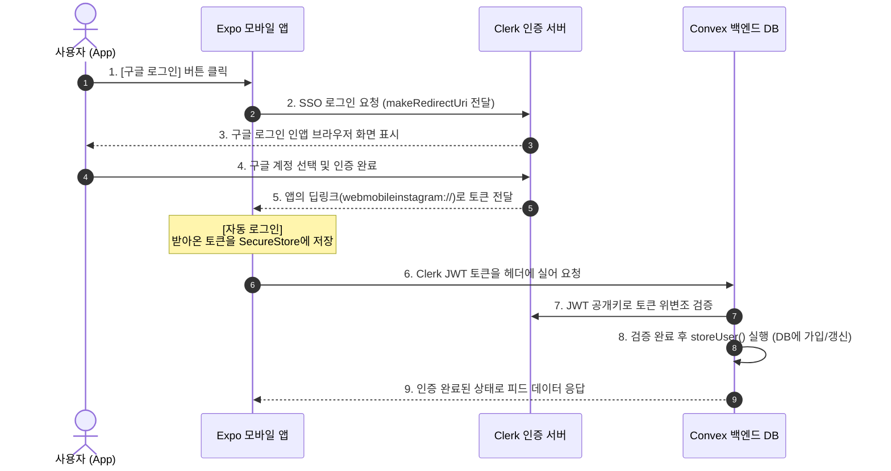

# 🔐 Clerk & Expo 간편 로그인 및 회원 연동 초보자 가이드

이 문서는 **Expo (React Native)** 모바일 앱 환경에서 **Clerk** 서비스를 이용해 Google 소셜 로그인을 구축하고, 로그인 세션을 기기에 암호화하여 저장(자동 로그인 유지)하는 한편, **Convex 백엔드 DB**와 안전하게 유저 데이터를 동기화하는 전 과정을 초보자 눈높이에서 가장 쉽고 친절하게 설명합니다.

---

## 🗺️ 한눈에 보는 인증 및 동기화 흐름 (Architecture)

초보자분들이 가장 헷갈려하는 **"구글 로그인을 했는데 왜 Convex DB에 회원이 등록되고 로그인이 유지될까?"**에 대한 흐름도입니다.



---

## 🔑 필수 용어 3분 요약
* **OAuth (소셜 로그인)**: 아이디/비밀번호를 직접 입력받지 않고, 구글 등 대기업의 인증 시스템을 빌려 안전하게 본인 확인을 하는 기술입니다.
* **JWT (JSON Web Token)**: 로그인 성공 시 발급되는 암호화된 '입장권'입니다. 우리 앱이 Convex 백엔드에 데이터를 요청할 때 이 입장권을 보여줍니다.
* **딥링크 (Deep Link)**: `https://` 대신 `webmobileinstagram://`처럼 모바일 브라우저나 타 앱에서 **우리 앱을 직접 깨워 특정 화면으로 이동시키는 주소**입니다.
* **웹훅 (Webhook)**: Clerk에서 회원가입이나 회원 정보 수정이 발생했을 때, 백엔드 서버(Convex)에게 *"방금 이 유저가 가입했으니 DB에 등록해!"*라고 실시간으로 알려주는 통신 방식입니다.

---

## 🚀 단계별 연동 가이드

---

### 1단계: Clerk 웹 대시보드에서 앱 개설하기
Clerk은 소셜 로그인 화면, 회원 관리, 세션 관리를 모두 무료로 제공해주는 서비스입니다.

1. **[Clerk 대시보드 (clerk.com)](https://clerk.com)**에 접속하여 가입 후 **Create Application**을 클릭합니다.
2. **Application name**에 프로젝트 이름(예: `Instagram-Clone`)을 입력합니다.
3. **How will users sign in?** 목록에서:
   * **Google**만 체크합니다.
   * 초보자의 쉬운 구현을 위해 기본값으로 체크되어 있는 **Email address**나 **Password**는 체크 해제합니다. (구글 소셜 로그인 전용 앱으로 설정)
4. **Create Application** 버튼을 누르면 대시보드가 개설됩니다.
5. 대시보드 첫 화면에 보이는 **`EXPO_PUBLIC_CLERK_PUBLISHABLE_KEY` (Publishable Key)**를 복사해 메모장에 저장해 둡니다. (`pk_test_...` 형식입니다)

---

### 2단계: 모바일 앱에 라이브러리 설치하기
터미널을 열고 프로젝트 루트 폴더에서 아래 명령어를 실행하여 필요한 패키지를 설치합니다:

```bash
npx expo install @clerk/expo expo-secure-store expo-auth-session expo-web-browser
```

#### 📦 각 패키지의 역할
* `@clerk/expo`: 로그인 상태 감지 및 소셜 로그인 실행용 핵심 SDK
* `expo-secure-store`: 기기의 안전한 보안 저장소. 로그인 토큰을 반영구 저장해 **자동 로그인**을 유지합니다.
* `expo-auth-session` / `expo-web-browser`: 간편 로그인창(인앱 브라우저)을 띄우고 인증 후 앱으로 되돌아오게 돕는 네이티브 브라우저 브릿지

---

### 3단계: 환경 변수 등록 및 앱 딥링크 정의하기

#### ① `.env.local` 파일 생성
프로젝트 루트 폴더에 `.env.local` 파일을 생성하고 1단계에서 복사한 Key를 기입합니다.
```env
# 프로젝트 루트 폴더/.env.local
EXPO_PUBLIC_CLERK_PUBLISHABLE_KEY=pk_test_자신의_Clerk_키_붙여넣기
```
> ⚠️ **중요**: Expo에서는 환경변수명이 반드시 `EXPO_PUBLIC_`으로 시작해야 모바일 앱 프론트엔드 코드(`process.env.EXPO_PUBLIC_...`)에서 읽을 수 있습니다.

#### ② `app.json`에 딥링크 Scheme 등록
사용자가 구글 로그인을 마친 뒤, 다시 우리 앱으로 튕겨 돌아올 때 사용할 고유 문 주소(Scheme)를 명시해야 합니다. `app.json`을 열고 `scheme` 속성을 지정합니다:
```json
{
  "expo": {
    "name": "webmobile-instagram",
    "slug": "webmobile-instagram",
    "scheme": "webmobileinstagram",  // 👈 영문 소문자로 공백 없이 고유하게 설정합니다.
    ...
  }
}
```

---

### 4단계: 자동 로그인을 위한 토큰 캐시 작성하기
앱을 종료했다가 다시 실행해도 로그인이 유지되게 만드는 물리 파일입니다. 

* **생성할 파일**: [clerk-expo/tokenCache.ts](file:///Users/guniluk/Desktop/CLI/webMobile-instagram/clerk-expo/tokenCache.ts)
```typescript
import * as SecureStore from 'expo-secure-store';
import { Platform } from 'react-native';

const createTokenCache = () => {
  return {
    // 1. 기기 저장소에서 토큰 읽어오기 (자동 로그인 확인용)
    async getToken(key: string) {
      try {
        if (Platform.OS === 'web') {
          return localStorage.getItem(key);
        }
        return await SecureStore.getItemAsync(key);
      } catch (error) {
        console.error('Clerk tokenCache.getToken error:', error);
        return null;
      }
    },
    // 2. 로그인 성공 시 발급받은 토큰 기기에 저장하기
    async saveToken(key: string, value: string) {
      try {
        if (Platform.OS === 'web') {
          localStorage.setItem(key, value);
          return;
        }
        await SecureStore.setItemAsync(key, value);
      } catch (error) {
        console.error('Clerk tokenCache.saveToken error:', error);
      }
    },
    // 3. 로그아웃 시 기기 내 토큰 파기하기
    async clearToken(key: string) {
      try {
        if (Platform.OS === 'web') {
          localStorage.removeItem(key);
          return;
        }
        await SecureStore.deleteItemAsync(key);
      } catch (error) {
        console.error('Clerk tokenCache.clearToken error:', error);
      }
    }
  };
};

export const tokenCache = createTokenCache();
```

---

### 5단계: App 루트 레이아웃에 Clerk & Convex 연결하기
모든 화면에서 로그인 정보에 접근할 수 있게 최상위 레이아웃을 Clerk과 Convex 제공자로 감싸줍니다.

* **설정 대상**: [app/_layout.tsx](file:///Users/guniluk/Desktop/CLI/webMobile-instagram/app/_layout.tsx)
* **주요 구성 패턴**:
```tsx
import { ClerkProvider, useAuth } from "@clerk/expo";
import { ConvexReactClient, useMutation, useConvexAuth } from "convex/react";
import { ConvexProviderWithClerk } from "convex/react-clerk";
import { tokenCache } from "../clerk-expo/tokenCache";

const publishableKey = process.env.EXPO_PUBLIC_CLERK_PUBLISHABLE_KEY!;
const convexUrl = process.env.EXPO_PUBLIC_CONVEX_URL!;

const convex = new ConvexReactClient(convexUrl);

export default function RootLayout() {
  return (
    // 1. Clerk에게 토큰 캐시 유틸과 키를 주입하여 감싸기
    <ClerkProvider publishableKey={publishableKey} tokenCache={tokenCache}>
      {/* 2. Convex와 Clerk을 하이브리드 바인딩하여 백엔드 보안 수립 */}
      <ConvexProviderWithClerk client={convex} useAuth={useAuth}>
        <MainLayout />
      </ConvexProviderWithClerk>
    </ClerkProvider>
  );
}
```
> 💡 `MainLayout` 컴포넌트 내부에서는 `useAuth()` 훅을 사용하여 `isSignedIn` 상태가 변경될 때 로그인 화면(`/(auth)/sign-in`) 또는 메인 탭(`/(tabs)`)으로 사용자를 자동으로 유도(Redirect)합니다.

---

### 6단계: Google 소셜 로그인 화면 구현하기
`useSSO` 훅을 사용해 모바일 웹 브라우저를 띄우고 구글 인증 절차를 실행합니다.

* **설정 대상**: [app/(auth)/sign-in.tsx](file:///Users/guniluk/Desktop/CLI/webMobile-instagram/app/(auth)/sign-in.tsx)
* **핵심 소셜 로그인 함수**:
```tsx
import { useSSO } from "@clerk/expo";
import * as AuthSession from "expo-auth-session";
import * as WebBrowser from "expo-web-browser";

// 브라우저 리디렉션 흐름을 정상 종료하기 위해 필수 선언
WebBrowser.maybeCompleteAuthSession();

export default function SignInScreen() {
  const { startSSOFlow } = useSSO();
  const [isLoading, setIsLoading] = React.useState(false);

  const onGoogleSignIn = async () => {
    try {
      setIsLoading(true);
      
      // app.json에 설정한 scheme과 똑같이 리디렉션 URI 주소를 빌드합니다.
      const redirectUrl = AuthSession.makeRedirectUri({
        scheme: "webmobileinstagram", // 👈 3단계 ②에서 설정한 스키마명과 완전히 일치해야 함!
        path: "(tabs)",
      });
      
      const { createdSessionId, setActive } = await startSSOFlow({
        strategy: "oauth_google",
        redirectUrl,
      });

      // 세션이 성공적으로 생성되면, 해당 세션을 활성화하여 로그인을 마칩니다.
      if (createdSessionId && setActive) {
        await setActive({ session: createdSessionId });
      }
    } catch (err) {
      console.error("Google Sign-In Error:", err);
    } finally {
      setIsLoading(false);
    }
  };
  
  // (이하 생략 - 상세 코드는 sign-in.tsx 파일 참조)
}
```

---

### 7단계: Clerk 웹 대시보드에 리디렉션 주소 등록하기 (필수 🌟)
구글 인증 성공 후, Clerk 서버가 신뢰하고 사용자를 돌려보낼 수 있도록 화이트리스트 주소를 대시보드에 꼭 등록해야 합니다. **안 하면 인증 성공 직후 흰 화면에서 멈추게 됩니다.**

1. **Clerk 웹 대시보드** 접속 후 해당 프로젝트 선택.
2. 왼쪽 메뉴에서 **Configure** > **Paths** 메뉴로 이동합니다.
3. **Redirect URLs** 섹션에서 **Add Redirect URL** 버튼을 클릭합니다.
4. 아래 주소들을 차례로 입력하고 추가합니다:
   * **실제 스마트폰 및 시뮬레이터 테스트용**: `webmobileinstagram://(tabs)` (본인의 `scheme://(tabs)` 형태)
   * **Expo Go 디버깅용**: 가끔 무선 환경에서 `exp://192.168.x.x:8081` 과 같은 IP 기반 리디렉션 에러가 뜬다면 에러 메시지에 찍힌 `exp://...` 주소도 여기에 같이 추가해 줍니다.

---

### 8단계: Convex 백엔드 연동을 위한 JWT 템플릿 설정하기
Convex 백엔드가 Clerk 로그인 정보를 해독하여 유저의 고유 ID와 정보를 안전하게 신뢰할 수 있게 해줍니다.

1. Clerk 웹 대시보드 왼쪽 메뉴의 **Configure** > **JWT Templates** 클릭.
2. **New Template** 버튼을 클릭한 뒤 목록에서 **Convex**를 선택합니다.
3. 설정 창 하단에 있는 **Issuer URL** 주소값을 전체 복사합니다. 
   *(예: `https://sleek-hare-88.clerk.accounts.dev`)*
4. **Create**를 클릭하여 템플릿을 생성합니다.
5. 프로젝트 백엔드 폴더 내의 [convex/auth.config.ts](file:///Users/guniluk/Desktop/CLI/webMobile-instagram/convex/auth.config.ts) 파일을 열고 복사한 **Issuer URL**을 기입합니다:
```typescript
export default {
  providers: [
    {
      domain: "https://sleek-hare-88.clerk.accounts.dev", // 👈 복사한 Issuer URL을 그대로 입력
      applicationID: "convex",
    },
  ],
};
```
6. 터미널에서 `npx convex dev`를 실행하고 있거나 재시작하면, 이 보안 설정이 즉시 Convex 클라우드 백엔드 인스턴스에 반영됩니다.

---

### 9단계: Clerk Webhook으로 Convex DB 회원가입 동기화하기 (Svix 연동)
사용자가 로그인했을 때 Convex DB의 `users` 테이블에 자동으로 사용자의 이름, 이메일, 프로필 사진 URL이 동기화되도록 웹훅(Webhook)을 설정합니다.

1. **Convex 대시보드 (dashboard.convex.dev)** 접속 -> 본인 프로젝트 선택 -> 왼쪽 **Settings** -> **URL & Deployments**로 이동합니다.
2. **HTTP / Site URL** 주소를 복사합니다. *(예: `https://neat-elk-123.convex.site`)*
   * 우리의 실제 웹훅 수신 주소는 뒤에 `/clerk-webhook` 이 붙은 `https://neat-elk-123.convex.site/clerk-webhook`이 됩니다.
3. **Clerk 웹 대시보드** 접속 -> 왼쪽 **Configure** > **Webhooks** 클릭 -> **Add Endpoint** 클릭.
4. **Endpoint URL**에 위의 Convex 웹훅 주소(`https://.../clerk-webhook`)를 입력합니다.
5. **Message Filtering**에서 아래 2가지 이벤트를 선택(체크)합니다:
   * `user.created` (신규 가입 시 실행)
   * `user.updated` (프로필 사진, 닉네임 수정 시 실행)
6. **Create**를 클릭하면 웹훅 엔드포인트가 생성됩니다.
7. 생성 완료 화면 우측에 있는 **Signing Secret** 키값(`whsec_...` 로 시작함)을 복사합니다.
8. 다시 **Convex 대시보드**의 **Settings** -> **Environment Variables**로 이동하여 새로운 환경변수를 등록합니다:
   * **Name**: `CLERK_WEBHOOK_SECRET`
   * **Value**: 복사한 `whsec_...` 문자열 키값 입력 후 Save
9. 이제 구글 로그인을 마치는 즉시 Clerk이 Convex의 웹훅 수신 함수(`convex/http.ts`)로 데이터를 전달해 Convex DB `users` 테이블에 사용자가 실시간 가입 처리됩니다.

---

## 🚨 초보자를 위한 꿀팁 & 트러블슈팅 (FAQ)

### Q1. 로그인 버튼을 누르면 인앱 브라우저는 뜨는데, 로그인 완료 후 아무 반응이 없거나 앱으로 안 돌아와요!
* **원인**: 앱의 딥링크 스키마 설정(`app.json`)과 코드 상의 `redirectUrl`, 그리고 Clerk 대시보드에 등록한 리디렉션 주소 3가지가 단 한 글자라도 매칭되지 않았기 때문입니다.
* **해결법**:
  1. `app.json`의 `"scheme": "webmobileinstagram"` 확인. (반드시 영문 소문자만 사용 권장)
  2. `sign-in.tsx`의 `redirectUrl`에서 `scheme: "webmobileinstagram"` 인지 확인.
  3. Clerk 대시보드 -> Paths -> Redirect URLs에 `webmobileinstagram://(tabs)`가 오타 없이 완벽히 추가되었는지 확인.

### Q2. 로그인은 성공했는데 Convex DB(대시보드)에 유저 정보가 안 쌓여요!
* **원인 1**: Clerk Webhook Signing Secret 연동이 빠졌거나 틀렸습니다.
  * **해결법**: Convex Dashboard의 Environment Variables에 `CLERK_WEBHOOK_SECRET` 이름으로 `whsec_...` 값이 빈칸 없이 잘 저장되어 있는지 재확인하세요.
* **원인 2**: Clerk JWT 템플릿의 Issuer URL이 `convex/auth.config.ts`와 다릅니다.
  * **해결법**: Clerk Dashboard의 JWT Templates -> Convex 항목에 복사된 `Issuer URL`과 `convex/auth.config.ts` 내 `domain` 값이 정확히 같은지 검증하세요. `https://` 프로토콜 주소인지 확인합니다.

### Q3. 에뮬레이터나 실기기 테스트 도중 캐시가 꼬여서 로그인 상태가 이상해요.
* **원인**: Expo Metro 서버에 인증 상태나 번들 캐시가 강하게 남아있을 수 있습니다.
* **해결법**: 터미널에서 가동 중인 Expo 프로세스를 종료한 뒤, 아래 명령어로 캐시를 깨끗이 날리고 재실행해 줍니다:
  ```bash
  npx expo start -c
  ```
  이후 디바이스(또는 에뮬레이터)에서 앱을 삭제하고 새로 설치하여 테스트하면 캐시가 깔끔하게 정리됩니다.

### Q4. 로그아웃을 하려면 어떻게 코드를 짜야 하나요?
* **해결법**: Clerk Expo SDK의 `useAuth` 훅에서 제공하는 `signOut` 비동기 함수를 호출하기만 하면 됩니다. 기기 내 저장된 토큰 캐시가 자동으로 삭제되면서 앱 최상단 루트 레이아웃이 로그인 화면으로 자동 리다이렉트합니다.
  ```tsx
  import { useAuth } from "@clerk/expo";
  import { Button } from "react-native";

  export function LogoutButton() {
    const { signOut } = useAuth();
    return <Button title="Sign Out" onPress={() => signOut()} />;
  }
  ```
