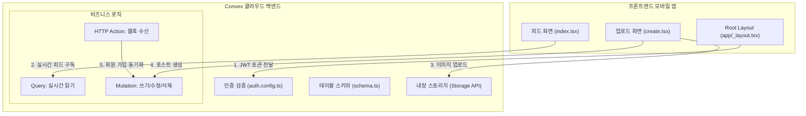
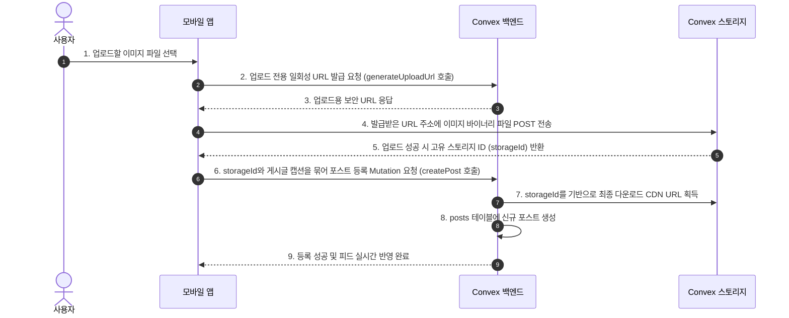

# 🛠️ Convex 실시간 백엔드 & 데이터베이스 초보자 가이드

이 문서는 실시간 반응형 클라우드 백엔드 서비스인 **Convex**를 프로젝트에 연동하고, 데이터베이스 스키마 및 CRUD API를 구성하고 관리하는 전 과정을 초보자용 눈높이로 세밀하게 설명합니다.

---

## 🗺️ 한눈에 보는 Convex 작동 아키텍처



---

## 🔑 필수 용어 & 개념 3분 요약

### 1. Convex란 무엇인가요?
* Firebase나 Supabase처럼, 백엔드 서버 코딩과 데이터베이스 구축을 통합하여 클라우드에 한 번에 구축해 주는 **Serverless 백엔드 플랫폼**입니다.
* 가장 큰 장점은 **자동 실시간 동기화(Reactive)**입니다. DB의 데이터가 바뀌면 프론트엔드가 따로 새로고침하지 않아도 화면이 알아서 갱신됩니다.

### 2. 핵심 3대 함수 개념
* 쿼리와 뮤테이션 내부에서는 외부 API 호출(`fetch`)이나 랜덤값 생성(`Math.random()`), 현재 시각 조회(`Date.now()`) 등을 직접 사용할 수 없습니다. 이를 위해 **Action**이 존재합니다.

| 개념 | 용도 | 특징 |
| :--- | :--- | :--- |
| **Query (쿼리)** | DB 데이터 읽기 | 데이터가 변경되면 프론트엔드에 자동으로 실시간 반영됩니다. (Read Only) |
| **Mutation (뮤테이션)** | DB 데이터 쓰기/수정/삭제 | 트랜잭션이 보장되며, 안전하게 데이터를 변경(Insert, Patch, Delete)합니다. |
| **Action (액션)** | 외부 API 통신 / 비동기 작업 | 네트워크 통신(fetch)이나 결제, AI 모델 API 호출 등을 수행합니다. |
| **HTTP Action** | 외부 웹훅 수신 | Clerk 등 제3의 서비스로부터 웹 요청을 받아 처리하는 특별한 엔드포인트입니다. |

### 3. Convex Storage (내장 스토리지)
* 이미지, 비디오, PDF 같은 큰 용량의 파일을 업로드하고 다운로드 주소(CDN URL)를 제공하는 클라우드 저장소입니다.

---

## 🚀 단계별 연동 가이드

---

### 1단계: Convex 설치 및 클라우드 초기화
1. 터미널을 열고 프로젝트 루트 폴더에서 Convex 패키지를 설치합니다:
   ```bash
   npm install convex
   ```
2. 로컬 개발 서버와 클라우드 백엔드를 실시간 동기화 상태로 시작합니다:
   ```bash
   npx convex dev
   ```
   * **최초 실행 시**: 브라우저 창이 열리며 Convex 로그인(GitHub 등)을 안내합니다.
   * 로그인이 완료되면 자동으로 현재 프로젝트의 클라우드 백엔드 인스턴스가 개설되고, 고유 접속 주소가 [.env.local](file:///Users/guniluk/Desktop/CLI/webMobile-instagram/.env.local) 파일에 `EXPO_PUBLIC_CONVEX_URL` 변수로 자동 기입됩니다.
   * **💡 꿀팁**: 개발을 진행하는 동안 이 명령어를 터미널 창에 계속 켜두세요. `convex/` 내에 소스코드를 수정하고 저장할 때마다 자동으로 빌드 검증을 거쳐 백엔드에 실시간 반영 및 배포됩니다.

---

### 2단계: 데이터베이스 스키마 설계하기
Convex는 파일 기반으로 테이블 구조를 정의합니다. 스키마에 작성되지 않은 컬럼은 DB에 저장되지 않으므로 철저하게 구성해야 합니다.

* **설정 파일**: [convex/schema.ts](file:///Users/guniluk/Desktop/CLI/webMobile-instagram/convex/schema.ts)
* **스키마 작성 법**:
```typescript
import { defineSchema, defineTable } from "convex/server";
import { v } from "convex/values"; // 값 검증을 위한 밸리데이터 모듈

export default defineSchema({
  // 1. users 테이블 정의
  users: defineTable({
    username: v.string(),
    fullname: v.string(),
    email: v.string(),
    bio: v.optional(v.string()), // v.optional()은 필수값이 아님을 뜻합니다.
    image: v.string(),
    followers: v.number(),
    following: v.number(),
    posts: v.number(),
    clerkId: v.string(),
  }).index("by_clerk_id", ["clerkId"]), // 인덱스를 생성해 빠른 조회가 가능하도록 돕습니다.

  // 2. posts 테이블 정의
  posts: defineTable({
    userId: v.id("users"), // 다른 테이블의 고유 ID를 가리킬 땐 v.id("테이블명")을 씁니다.
    imageUrl: v.string(),
    storageId: v.id("_storage"), // Convex 내장 스토리지의 고유 ID 타입입니다.
    caption: v.optional(v.string()),
    likes: v.number(),
    comments: v.number(),
  }).index("by_user", ["userId"]),

  // 3. likes 테이블 정의
  likes: defineTable({
    userId: v.id("users"),
    postId: v.id("posts"),
  })
    .index("by_post", ["postId"])
    .index("by_user_and_post", ["userId", "postId"]),

  // (이하 생략 - 상세 스키마 구조는 schema.ts 참조)
});
```

---

### 3단계: Clerk 로그인 회원 정보 연동하기 (`auth.config.ts`)
Convex가 Clerk의 로그인을 신뢰할 수 있도록 설정해 줍니다. 
*(상세 주소 복사 법은 `clerk.md` 가이드의 8단계를 참고하세요.)*

* **설정 파일**: [convex/auth.config.ts](file:///Users/guniluk/Desktop/CLI/webMobile-instagram/convex/auth.config.ts)
```typescript
export default {
  providers: [
    {
      // Clerk Dashboard -> JWT Templates -> Convex 템플릿의 Issuer URL 주소를 붙여넣습니다.
      domain: "https://your-clerk-issuer-domain.clerk.accounts.dev", 
      applicationID: "convex",
    },
  ],
};
```

---

### 4단계: 가입자 자동 등록 API 구현하기 (`users.ts`)
로그인을 완료한 유저가 Convex DB의 `users` 테이블에 자동으로 보관되고 조회되도록 구현합니다.

* **설정 파일**: [convex/users.ts](file:///Users/guniluk/Desktop/CLI/webMobile-instagram/convex/users.ts)
```typescript
import { mutation, query } from "./_generated/server";
import { v } from "convex/values";

/**
 * 1. 프론트엔드 로그인 직후 호출되어 유저를 저장/갱신하는 Mutation
 */
export const storeUser = mutation({
  args: {},
  handler: async (ctx) => {
    // Clerk 토큰 정보로부터 현재 로그인한 사용자 신원 가져오기
    const identity = await ctx.auth.getUserIdentity();
    if (!identity) {
      throw new Error("인증되지 않은 요청입니다.");
    }

    // Clerk ID로 기존에 가입된 사용자가 있는지 조회
    const user = await ctx.db
      .query("users")
      .withIndex("by_clerk_id", (q) => q.eq("clerkId", identity.subject))
      .unique();

    const email = identity.email ?? "";
    const username = identity.nickname ?? email.split("@")[0] ?? "user";
    const fullname = identity.name ?? username;
    const image = identity.pictureUrl ?? "";

    if (user === null) {
      // 신규 회원 등록
      return await ctx.db.insert("users", {
        clerkId: identity.subject,
        email: email,
        username: username,
        fullname: fullname,
        image: image,
        followers: 0,
        following: 0,
        posts: 0,
      });
    }

    // 기존 회원 정보 갱신
    await ctx.db.patch(user._id, {
      email: email,
      username: username,
      fullname: fullname,
      image: image,
    });

    return user._id;
  },
});
```

---

### 5단계: Clerk Webhook 실시간 수신 및 동기화 구현 (`http.ts`)
모바일 앱이 켜져 있지 않을 때에도(예: 백그라운드 가입/수정) Clerk과 회원 데이터를 완벽하게 동기화하기 위한 엔드포인트(웹훅 수신)를 뚫어주는 코드입니다.

웹훅의 위변조 방지를 위해 `svix`라는 서명 검증 라이브러리를 먼저 설치합니다.
```bash
npm install svix @clerk/backend
```

* **설정 파일**: [convex/http.ts](file:///Users/guniluk/Desktop/CLI/webMobile-instagram/convex/http.ts)
```typescript
import { httpRouter } from "convex/server";
import { Webhook } from "svix"; // 서명 검증 모듈
import { api } from "./_generated/api";
import { httpAction } from "./_generated/server";

export const http = httpRouter();

http.route({
  path: "/clerk-webhook", // 👈 이 엔드포인트로 외부 Clerk 알림을 수신합니다.
  method: "POST",
  handler: httpAction(async (ctx, request) => {
    const webhookSecret = process.env.CLERK_WEBHOOK_SECRET;
    if (!webhookSecret) {
      return new Response("CLERK_WEBHOOK_SECRET not set", { status: 500 });
    }

    // 보안 검증용 헤더 추출
    const svix_id = request.headers.get("svix-id");
    const svix_timestamp = request.headers.get("svix-timestamp");
    const svix_signature = request.headers.get("svix-signature");

    if (!svix_id || !svix_timestamp || !svix_signature) {
      return new Response("Missing svix headers", { status: 400 });
    }

    const body = await request.text();
    const webhook = new Webhook(webhookSecret);
    let evt: any;

    // 전달받은 웹훅이 Clerk에서 정식 발송된 것인지 위변조 여부 검증
    try {
      evt = webhook.verify(body, {
        "svix-id": svix_id,
        "svix-timestamp": svix_timestamp,
        "svix-signature": svix_signature,
      }) as any;
    } catch (err) {
      console.error("Error verifying webhook:", err);
      return new Response("Error verifying webhook", { status: 400 });
    }

    const eventType = evt.type;
    
    // 가입(created) 및 정보 수정(updated) 시 DB 동기화 실행
    if (eventType === "user.created" || eventType === "user.updated") {
      const { id, email_addresses, first_name, last_name, image_url, username } = evt.data;
      
      const email = email_addresses?.[0]?.email_address ?? "";
      const name = `${first_name || ""} ${last_name || ""}`.trim() || username || email.split("@")[0] || "User";
      const userUsername = username || email.split("@")[0] || "user";

      try {
        // 백엔드의 실제 Mutation인 createOrUpdateUserFromWebhook을 실행하여 DB 저장
        await ctx.runMutation(api.users.createOrUpdateUserFromWebhook, {
          clerkId: id,
          email: email,
          username: userUsername,
          fullname: name,
          image: image_url ?? "",
        });
      } catch (error) {
        console.error("Error syncing user to database:", error);
        return new Response("Error syncing user to database", { status: 500 });
      }
    }
    
    return new Response("Webhook processed successfully", { status: 200 });
  }),
});

export default http;
```

---

### 6단계: 모바일 앱 프론트엔드 연동 및 실시간 쿼리 사용하기
모바일 앱의 화면(Screen 컴포넌트)에서 Convex의 실시간 데이터를 뿌려주는 법입니다.

* **설정 대상**: [app/(tabs)/index.tsx](file:///Users/guniluk/Desktop/CLI/webMobile-instagram/app/(tabs)/index.tsx)
```tsx
import { useQuery, useMutation } from "convex/react";
import { api } from "@/convex/_generated/api"; // 👈 npx convex dev가 자동으로 빌드해준 API 타입 바인딩
import { Text, FlatList, View } from "react-native";

export default function FeedScreen() {
  // 1. 실시간 쿼리 구독 (DB가 바뀌면 이 posts 변수 값이 알아서 바뀌며 화면이 재렌더링됩니다!)
  const posts = useQuery(api.posts.getFeedPosts);
  
  // 2. 뮤테이션 호출 함수 선언 (좋아요 토글 등)
  const toggleLike = useMutation(api.likes.toggleLike);

  if (posts === undefined) {
    // 아직 데이터를 로딩 중인 상태
    return <Text>Loading feed...</Text>;
  }

  return (
    <FlatList
      data={posts}
      keyExtractor={(item) => item._id} // Convex DB의 고유 ID인 _id 사용
      renderItem={({ item }) => (
        <View>
          <Text>{item.caption}</Text>
          <Text onPress={() => toggleLike({ postId: item._id })}>
            ❤️ {item.likes}
          </Text>
        </View>
      )}
    />
  );
}
```

---

### 7단계: Convex Storage 미디어 업로드 및 연동 (매우 중요 🌟)
인스타그램 클론 코딩에서 가장 중요한 **사진 업로드** 구현 흐름입니다. 모바일 기기의 바이너리 파일을 Convex 내장 스토리지에 업로드하고 가져오는 상세 과정입니다.



#### ① 일회성 업로드 주소 발급 및 생성 API
* **설정 파일**: [convex/posts.ts](file:///Users/guniluk/Desktop/CLI/webMobile-instagram/convex/posts.ts)
```typescript
import { mutation } from "./_generated/server";
import { v } from "convex/values";

// 1. 일회성 이미지 업로드 URL 발급 API
export const generateUploadUrl = mutation({
  args: {},
  handler: async (ctx) => {
    return await ctx.storage.generateUploadUrl();
  },
});

// 2. 포스트 최종 생성 API
export const createPost = mutation({
  args: {
    storageId: v.id("_storage"),
    caption: v.optional(v.string()),
  },
  handler: async (ctx, args) => {
    const identity = await ctx.auth.getUserIdentity();
    if (!identity) throw new Error("인증되지 않았습니다.");

    const user = await ctx.db
      .query("users")
      .withIndex("by_clerk_id", (q) => q.eq("clerkId", identity.subject))
      .unique();
    if (!user) throw new Error("사용자 정보를 찾을 수 없습니다.");

    // 스토리지 ID를 최종 다운로드 CDN 주소로 변환합니다.
    const imageUrl = await ctx.storage.getUrl(args.storageId);
    if (!imageUrl) throw new Error("이미지 URL 변환 실패");

    // DB에 포스트 기록
    const postId = await ctx.db.insert("posts", {
      userId: user._id,
      imageUrl: imageUrl,
      storageId: args.storageId,
      caption: args.caption,
      likes: 0,
      comments: 0,
    });

    return postId;
  },
});
```

#### ② 프론트엔드 모바일 사진 실제 업로드 로직
* **설정 파일**: [app/(tabs)/create.tsx](file:///Users/guniluk/Desktop/CLI/webMobile-instagram/app/(tabs)/create.tsx)
```typescript
const generateUploadUrl = useMutation(api.posts.generateUploadUrl);
const createPost = useMutation(api.posts.createPost);

const handleUpload = async (imageUri: string, captionText: string) => {
  try {
    // 1단계: 업로드 URL 발급
    const uploadUrl = await generateUploadUrl();

    // 2단계: 이미지 로컬 경로에서 파일 데이터 가져오기
    const response = await fetch(imageUri);
    const blob = await response.blob(); // 바이너리 블롭 객체 변환

    // 3단계: Convex Storage에 실제 업로드 진행
    const uploadResponse = await fetch(uploadUrl, {
      method: "POST",
      headers: { "Content-Type": blob.type },
      body: blob,
    });

    if (!uploadResponse.ok) throw new Error("스토리지 업로드 실패");

    // 스토리지 고유 ID 획득
    const { storageId } = await uploadResponse.json();

    // 4단계: 포스트 생성 요청
    await createPost({
      storageId: storageId,
      caption: captionText,
    });
    
    alert("게시물이 성공적으로 업로드되었습니다!");
  } catch (error) {
    console.error(error);
  }
};
```

---

## 🚨 초보자를 위한 꿀팁 & 트러블슈팅 (FAQ)

### Q1. 백엔드 함수 코드를 변경했는데 프론트엔드에서 타입 에러가 나거나 자동완성이 먹통이에요!
* **원인**: 백엔드 파일이 변경되었지만, 이에 맞춰 프론트엔드용 타입스크립트 인터페이스 파일(`convex/_generated/...`)이 갱신되지 않았기 때문입니다.
* **해결법**: 터미널에 `npx convex dev`가 켜져 있는지 확인하고, 만약 꺼졌다면 다시 실행해 주세요. 강제로 동기화하고 싶다면 아래 명령어로 타입을 즉시 수동 갱신할 수 있습니다:
  ```bash
  npx convex codegen
  ```

### Q2. 쿼리(Query) 함수 내에서 외부 날씨 API나 회원 정보를 fetch()하고 싶은데 에러가 나요!
* **원인**: Convex의 Query와 Mutation은 **결정론적 실행(Deterministic Execution)**을 엄격하게 준수합니다. 즉, 언제 실행해도 똑같은 입력엔 똑같은 결과가 보장되어야 하므로 DB 바깥 세상과의 통신(Date, Math.random, fetch)을 차단합니다.
* **해결법**: 외부 API 연동이나 결제, 비동기 처리가 필요하다면 **Action(액션)**을 정의해서 작성해야 합니다:
  ```typescript
  import { action } from "./_generated/server";

  export const fetchWeather = action({
    args: {},
    handler: async (ctx) => {
      const response = await fetch("https://api.weather.com/...");
      const data = await response.json();
      return data;
    }
  });
  ```

### Q3. 데이터를 등록하거나 삭제하는 기능을 연동할 때 주의할 점은 무엇인가요?
* **해결법**: 인스타그램 앱처럼 게시물을 삭제할 때는 단순히 포스트 데이터만 삭제하는 데 그치지 않고, 연쇄적으로 일어날 일들을 함께 묶어서 처리해주어야 찌꺼기 데이터가 남지 않습니다.
* 이를 **연쇄 삭제 (Cascade Delete)**라 부르며, 한 Mutation 내부에서 게시글 삭제와 연계된 좋아요, 댓글, 북마크, 알림 및 **Storage 내 실제 이미지 파일**까지 일괄적으로 삭제하는 코드를 작성하는 것을 강력히 권장합니다:
  ```typescript
  // 예시: 포스트와 업로드된 스토리지 파일 동시 제거
  await ctx.storage.delete(post.storageId); // 실제 스토리지 파일 삭제
  await ctx.db.delete(postId);             // DB 포스트 삭제
  ```

### Q4. Convex에 등록된 데이터 테이블들을 한눈에 쉽게 확인하고 조작할 수 있나요?
* **해결법**: 브라우저 창에서 실시간 데이터베이스를 관리할 수 있는 최적의 웹 어드민 뷰를 제공합니다. 터미널 창에 다음 명령어를 입력하면 Convex Dashboard 페이지가 즉시 실행됩니다:
  ```bash
  npx convex dashboard
  ```
  여기서 실제 유저 정보, 게시글 리스트, 실시간 서버 로그(Console.log 출력물 포함) 및 파일 보관함(Storage) 내부를 생생하게 확인 및 제어할 수 있습니다.

---

## 🛠️ 핵심 CLI 명령어 요약

| 명령어 | 용도 | 설명 |
| :--- | :--- | :--- |
| `npx convex dev` | 로컬 개발 & 실시간 동기화 | 로컬 소스 변경을 실시간 감지하여 클라우드에 배포하고 타입 바인딩을 자동 갱신합니다. |
| `npx convex codegen` | 타입 파일 빌드 | 배포하지 않고 오직 타입스크립트 바인딩 파일만 수동으로 갱신합니다. |
| `npx convex deploy` | 프로덕션 배포 | 실제 서비스 출시용 운영 환경 인스턴스에 백엔드를 고정 배포합니다. |
| `npx convex dashboard` | 대시보드 기동 | 웹 대시보드 페이지를 실행하여 실시간 로그와 데이터를 직접 모니터링합니다. |
